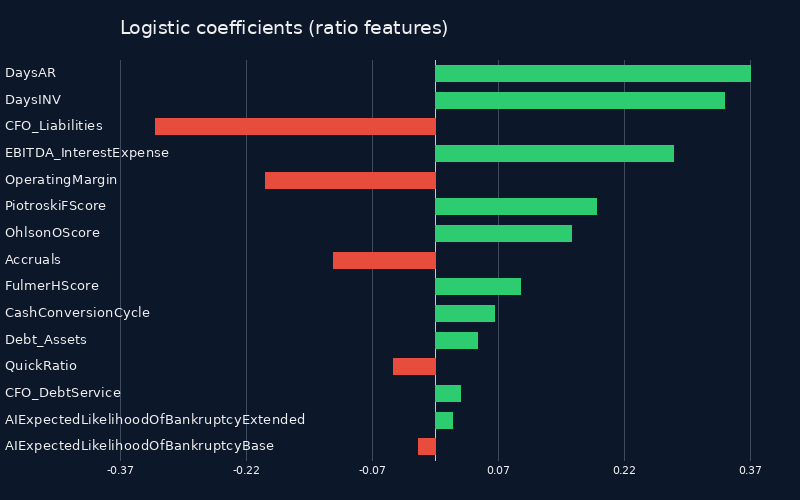
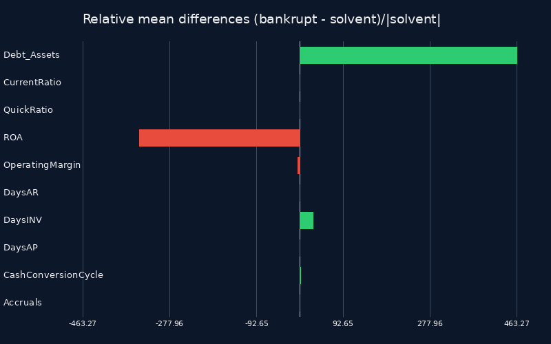
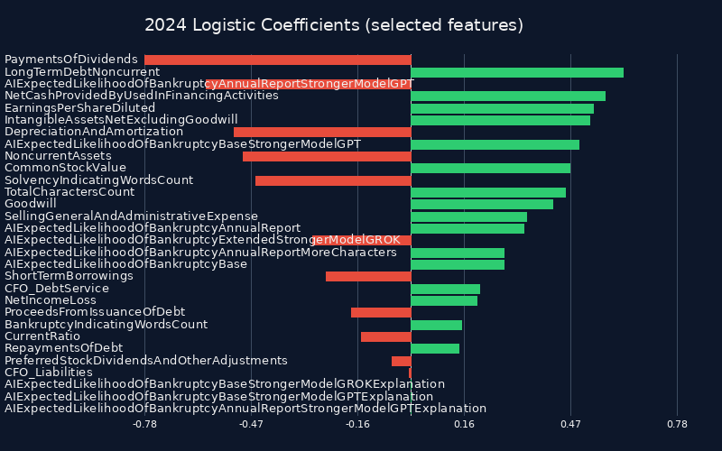
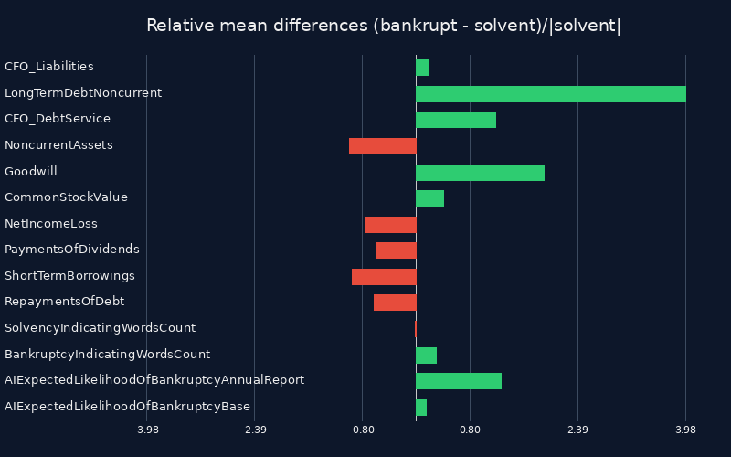

# Predicting Bankruptcies from Company Reports

## How to run

The simplest approach is to upload the whole repository to a web server using `FTP` and then access `https://www.SOMEPLACEHOLDERFORTHESERVERNAME.com/index.php` (replacing `SOMEPLACEHOLDERFORTHESERVERNAME` with the actual server name) in the browser.

Alternatively, `XAMPP` or similar programs can be used. The application is a plain PHP front end backed by filesystem storage. No composer installation or external services are required, everything needed ships with this folder. Simply starting PHP's built-in web server from the repository root (or any location) and pointing it at `/index.php`:

```bash
php -S localhost:8000 index.php
```

Then `http://localhost:8000/` has to be opened in the browser, the single page app served from `index.php` will load and the the UI can be used.
(For the machine-learning UI, navigate to `http://localhost:8000/ML/public/index.php` and follow the interactive training and prediction workflow documented in [`ML/README.md`](ML/README.md)).

To reproduce the data collection and processing, visit:
`https://www.SOMEPLACEHOLDERFORTHESERVERNAME.com/DataCollector0.php`, `https://www.SOMEPLACEHOLDERFORTHESERVERNAME.com/DataProcessor0.php`, ...
(or: `http://localhost:8000/DataCollector0.php`, `http://localhost:8000/DataProcessor0.php`, ...).

For running over the console, ensure PHP 8+ is installed and available on the `PATH`.
From the repository root run the collectors/processors as needed, for example:

```bash
php DataCollector0.php
php DataProcessor0.php
```

Once the scripts finish, refresh `index.php` in the browser to inspect the updated datasets. To refresh the `ML` datasets, first replace the files in `ML/data/raw` with their corresponding new versions and then reload the browser UI.

## Starting

This project gathers bankruptcy related 8‑K filings from the SEC EDGAR system and enriches them with company metadata and historical financial data.

Three CSV files are produced (and reports as attachments can be saved too if the corresponding part is commented in / activated) for bankrupt companies when running `DataCollector0.php`: `main.csv`, `financials.csv` and `reports.csv`.
In addition, we also select solvent/healthy/non-bankrupt companies and save their information in: `main_solvent.csv`, `financials_solvent.csv` and `reports_solvent.csv`, whereas in `main_solvent.csv` of course not all columns are filled out (only the columns regarding general company information).

## main.csv

One row per company containing the first bankruptcy filing found in the scanned year.

| Column | Description |
| --- | --- |
| BankruptcyDate | date extracted from the filing text |
| FilingDate | date the 8‑k was filed |
| FilingType | form type of the filing |
| BankruptcyChapter | bankruptcy chapter if detected |
| CourtName | court handling the bankruptcy |
| CaseNumber | bankruptcy case number |
| AccessionNumber | sec accession number |
| FilingURL | url of the filing |
| CIK | central index key |
| CompanyName | company name |
| exchange | primary exchange of the company |
| IndustrySICCode | industry sic code |
| FiscalYearEnd | company's fiscal year end |
| BusinessAddressState | business address state |
| BusinessAddressZIPCode | business address zip code |
| BusinessAddressCity | business address city |
| BusinessAddressStreet | business address street |
| BusinessAddressHouseNumber | business address house number (if available) |
| StateOfIncorporation | state of incorporation |
| Website | company website |
| InvestorWebsite | investor relations website |
| SIC | sic code |
| SICDescription | description of the sic code |

Example for general company data:
- [Apple](https://data.sec.gov/submissions/CIK0000320193.json)

## financials.csv

Historical financial metrics for each company from `YEAR - 10` through `YEAR` (2014‑2024 when YEAR=2024). Each row represents one year.

| Column | Description |
| --- | --- |
| idpk | sequential row identifier |
| CIK | central index key matching main.csv |
| year | fiscal year of the data |
| assets | total assets |
| CurrentAssets | current assets |
| NoncurrentAssets | non‑current assets |
| liabilities | total liabilities |
| CurrentLiabilities | current liabilities |
| NoncurrentLiabilities | non‑current liabilities |
| LiabilitiesAndStockholdersEquity | liabilities and stockholders' equity |
| equity | stockholders' equity |
| CommonStockValue | value of common stock |
| RetainedEarningsAccumulatedDeficit | retained earnings or accumulated deficit |
| AccumulatedOtherComprehensiveIncomeLoss | aoci |
| MinorityInterest | minority interest |
| revenues | total revenues |
| SalesRevenueNet | net sales revenue |
| CostOfGoodsSold | cost of goods sold |
| GrossProfit | gross profit |
| OperatingExpenses | operating expenses |
| SellingGeneralAndAdministrativeExpense | sg&a expense |
| ResearchAndDevelopmentExpense | research and development expense |
| OperatingIncomeLoss | operating income or loss |
| InterestExpense | interest expense |
| IncomeBeforeIncomeTaxes | income before taxes |
| IncomeTaxExpenseBenefit | income tax expense or benefit |
| NetIncomeLoss | net income or loss |
| PreferredStockDividendsAndOtherAdjustments | preferred stock dividends and other adjustments |
| NetIncomeLossAvailableToCommonStockholdersBasic | net income available to common stockholders (basic) |
| EarningsPerShareBasic | basic earnings per share |
| EarningsPerShareDiluted | diluted earnings per share |
| WeightedAverageNumberOfSharesOutstandingBasic | weighted average shares outstanding (basic) |
| WeightedAverageNumberOfDilutedSharesOutstanding | weighted average shares outstanding (diluted) |
| NetCashProvidedByUsedInOperatingActivities | net cash provided by or used in operating activities |
| NetCashProvidedByUsedInInvestingActivities | net cash provided by or used in investing activities |
| NetCashProvidedByUsedInFinancingActivities | net cash provided by or used in financing activities |
| CashAndCashEquivalentsPeriodIncreaseDecrease | increase/decrease in cash and cash equivalents |
| CashAndCashEquivalentsAtCarryingValue | cash and cash equivalents at carrying value |
| PaymentsToAcquirePropertyPlantAndEquipment | capital expenditures |
| ProceedsFromIssuanceOfCommonStock | proceeds from issuing common stock |
| PaymentsOfDividends | dividend payments |
| RepaymentsOfDebt | debt repayments |
| ProceedsFromIssuanceOfDebt | proceeds from issuing debt |
| DepreciationAndAmortization | depreciation and amortization |
| InventoryNet | net inventory |
| AccountsReceivableNetCurrent | net current accounts receivable |
| AccountsPayableCurrent | current accounts payable |
| Goodwill | goodwill |
| IntangibleAssetsNetExcludingGoodwill | intangible assets excluding goodwill |
| PropertyPlantAndEquipmentNet | property, plant and equipment (net) |
| LongTermDebtNoncurrent | non‑current long‑term debt |
| ShortTermBorrowings | short‑term borrowings |
| IncomeTaxesPayableCurrent | current income taxes payable |
| EntityRegistrantName | entity registrant name |
| EntityCentralIndexKey | central index key (repeated) |
| TradingSymbol | trading symbol |
| EntityIncorporationStateCountryCode | state or country of incorporation |
| EntityFilerCategory | filer category |
| DocumentPeriodEndDate | document period end date |
| DocumentFiscalPeriodFocus | document fiscal period focus |
| DocumentFiscalYearFocus | document fiscal year focus |
| DocumentType | document type |
| AmendmentFlag | amendment flag |
| CurrentFiscalYearEndDate | current fiscal year end date |

Example for company details data:
- [Apple](https://data.sec.gov/api/xbrl/companyfacts/CIK0000320193.json)

## reports.csv

Historical reports for each company from `YEAR - 10` through `YEAR` (2014‑2024 when YEAR=2024). Each row represents one year.

| Column | Description |
| --- | --- |
| idpk | sequential row identifier |
| CIK | central index key matching main.csv |
| year | fiscal year of the data |
| AnnualReportLink | link to the HTML file with the annual report |
| QuarterlyReportLinkQ1 | link to the HTML file with the quarterly report for Q1 |
| QuarterlyReportLinkQ2 | link to the HTML file with the quarterly report for Q2 |
| QuarterlyReportLinkQ3 | link to the HTML file with the quarterly report for Q3 |
| QuarterlyReportLinkQ4 | link to the HTML file with the quarterly report for Q4 |

## AnnualReports/

Historical annual reports for each company from `YEAR - 10` through `YEAR` (2014‑2024 when YEAR=2024).
Saved in the format: `[CIK]_[YEAR]`.html

Example for annual report company data:
- [Apple](https://www.sec.gov/Archives/edgar/data/320193/000032019324000123/aapl-20240928.htm)

## QuarterlyReports/

Historical quarterly reports for each company from `YEAR - 10` through `YEAR` (2014‑2024 when YEAR=2024).
Saved in the format: `[CIK]_[YEAR]_["Q1" or "Q2" or "Q3" or "Q4"]`.html

Example for quarterly report company data:
- [Apple](https://www.sec.gov/Archives/edgar/data/320193/000032019325000057/aapl-20250329.htm)

### USA federal holidays for year 2024

On the following days and on weekends, of course no bankruptcies happened.

| Date | Day of Week | Holiday Name |
| --- | --- | --- |
| January 1 | Monday | New Year's Day |
| January 15 | Monday | Birthday of Martin Luther King, Jr. |
| February 19 | Monday | Washington's Birthday (aka Presidents Day) |
| May 27 | Monday | Memorial Day |
| June 19 | Wednesday | Juneteenth National Independence Day |
| July 4 | Thursday | Independence Day |
| September 2 | Monday | Labor Day |
| October 14 | Monday | Columbus Day |
| November 11 | Monday | Veterans Day |
| November 28 | Thursday | Thanksgiving Day |
| December 25 | Wednesday | Christmas Day |

## Updating and cleaning

The `DataUpdaterAndCleaner0.php` script refreshes `financials.csv`, `financials_solvent.csv` and their subset files with values from 10-K/A amendments. It keeps the existing rows intact, refills missing numbers when amendments exist, cleans implausible outliers and syncs the updated values into the subset CSVs if they should already exist (allowing for more flexibility on the order of events in the pipeline). It also rewrites `reports.csv`, `reports_solvent.csv` (and their subset versions if available) so that any 10‑K/A amendment links are swapped back to the corresponding original 10‑K filings when those originals exist, keeping the full-length annual report text available for downstream AI analysis as the amendments only provide limited information on textual basis as they only mention adjustments. Many values were initially missing or couldn't be fetched automatically, because of missing XBRL or the use of non-standardized XBRL-tag-names. The script tries to be as robust as possible and also check the 101.INS-files and other tag-names, but some empty fields still remain.

**Some Examples for Unparsable Data without correct use of XBRL:**
* **CIK 0001959961 (2023)**, URL: https://www.sec.gov/Archives/edgar/data/1959961/000095017024034216/ck0001959961-20231231.htm
* **CIK 0001959961 (2024)**, URL: https://www.sec.gov/Archives/edgar/data/1959961/000095017025110909/ck0001959961-20241231.htm
* **CIK 0001626644 (2015)**, URL: https://www.sec.gov/Archives/edgar/data/1626644/000101968715004380/odyssey_10k-073115.htm
* **CIK 0001626644 (2016)**, URL: https://www.sec.gov/Archives/edgar/data/1626644/000168316816000458/odyssey_10k-073116.htm
* **CIK 0001626644 (2017)**, URL: https://www.sec.gov/Archives/edgar/data/1626644/000168316817003008/odyssey_10k.htm
(Missing for example: NoncurrentAssets, liabilities, NoncurrentLiabilities, AccumulatedOtherComprehensiveIncomeLoss, MinorityInterest, SalesRevenueNet, OperatingExpenses,SellingGeneralAndAdministrativeExpense, IncomeBeforeIncomeTaxes, IncomeTaxExpenseBenefit, PreferredStockDividendsAndOtherAdjustments,NetIncomeLossAvailableToCommonStockholdersBasic, EarningsPerShareDiluted, WeightedAverageNumberOfDilutedSharesOutstanding, ProceedsFromIssuanceOfCommonStock,PaymentsOfDividends, RepaymentsOfDebt, ProceedsFromIssuanceOfDebt, InventoryNet, Goodwill, IntangibleAssetsNetExcludingGoodwill, LongTermDebtNoncurrent,ShortTermBorrowings, IncomeTaxesPayableCurrent, ... )


## Financial ratio columns

The `DataProcessor0.php` script enriches `financials.csv` and `financials_solvent.csv` (and their subset versions if available) with additional ratios and distress scores. The table below lists all columns now present in these files, old and new ones.

| Column | Description | Explanation |
| --- | --- | --- |
| idpk | sequential row identifier | |
| CIK | central index key matching main.csv | |
| year | fiscal year of the data | |
| assets | total assets | |
| CurrentAssets | current assets | |
| NoncurrentAssets | non‑current assets | |
| liabilities | total liabilities | |
| CurrentLiabilities | current liabilities | |
| NoncurrentLiabilities | non‑current liabilities | |
| LiabilitiesAndStockholdersEquity | liabilities and stockholders' equity | |
| equity | stockholders' equity | |
| CommonStockValue | value of common stock | |
| RetainedEarningsAccumulatedDeficit | retained earnings or accumulated deficit | |
| AccumulatedOtherComprehensiveIncomeLoss | aoci | |
| MinorityInterest | minority interest | |
| revenues | total revenues | |
| SalesRevenueNet | net sales revenue | |
| CostOfGoodsSold | cost of goods sold | |
| GrossProfit | gross profit | |
| OperatingExpenses | operating expenses | |
| SellingGeneralAndAdministrativeExpense | sg&a expense | |
| ResearchAndDevelopmentExpense | research and development expense | |
| OperatingIncomeLoss | operating income or loss | |
| InterestExpense | interest expense | |
| IncomeBeforeIncomeTaxes | income before taxes | |
| IncomeTaxExpenseBenefit | income tax expense or benefit | |
| NetIncomeLoss | net income or loss | |
| PreferredStockDividendsAndOtherAdjustments | preferred stock dividends and other adjustments | |
| NetIncomeLossAvailableToCommonStockholdersBasic | net income available to common stockholders (basic) | |
| EarningsPerShareBasic | basic earnings per share | |
| EarningsPerShareDiluted | diluted earnings per share | |
| WeightedAverageNumberOfSharesOutstandingBasic | weighted average shares outstanding (basic) | |
| WeightedAverageNumberOfDilutedSharesOutstanding | weighted average shares outstanding (diluted) | |
| NetCashProvidedByUsedInOperatingActivities | net cash provided by or used in operating activities | |
| NetCashProvidedByUsedInInvestingActivities | net cash provided by or used in investing activities | |
| NetCashProvidedByUsedInFinancingActivities | net cash provided by or used in financing activities | |
| CashAndCashEquivalentsPeriodIncreaseDecrease | increase/decrease in cash and cash equivalents | |
| CashAndCashEquivalentsAtCarryingValue | cash and cash equivalents at carrying value | |
| PaymentsToAcquirePropertyPlantAndEquipment | capital expenditures | |
| ProceedsFromIssuanceOfCommonStock | proceeds from issuing common stock | |
| PaymentsOfDividends | dividend payments | |
| RepaymentsOfDebt | debt repayments | |
| ProceedsFromIssuanceOfDebt | proceeds from issuing debt | |
| DepreciationAndAmortization | depreciation and amortization | |
| InventoryNet | net inventory | |
| AccountsReceivableNetCurrent | net current accounts receivable | |
| AccountsPayableCurrent | current accounts payable | |
| Goodwill | goodwill | |
| IntangibleAssetsNetExcludingGoodwill | intangible assets excluding goodwill | |
| PropertyPlantAndEquipmentNet | property, plant and equipment (net) | |
| LongTermDebtNoncurrent | non‑current long‑term debt | |
| ShortTermBorrowings | short‑term borrowings | |
| IncomeTaxesPayableCurrent | current income taxes payable | |
| EntityRegistrantName | entity registrant name | |
| EntityCentralIndexKey | central index key (repeated) | |
| TradingSymbol | trading symbol | |
| EntityIncorporationStateCountryCode | state or country of incorporation | |
| EntityFilerCategory | filer category | |
| DocumentPeriodEndDate | document period end date | |
| DocumentFiscalPeriodFocus | document fiscal period focus | |
| DocumentFiscalYearFocus | document fiscal year focus | |
| DocumentType | document type | |
| AmendmentFlag | amendment flag | |
| CurrentFiscalYearEndDate | current fiscal year end date | |
| TL_TA | leverage (total liabilities / total assets) | measures overall leverage by comparing total liabilities to total assets, formula: `liabilities / assets` |
| Debt_Assets | debt to assets | uses long‑term and short‑term borrowings as a proxy for total debt, formula: `(LongTermDebtNoncurrent + ShortTermBorrowings) / assets` |
| EBIT_InterestExpense | EBIT over interest expense | interest coverage using `OperatingIncomeLoss` as an EBIT proxy, formula: `OperatingIncomeLoss / InterestExpense`, when `OperatingIncomeLoss` was missing, it was fallen back to `NetIncomeLoss + InterestExpense + IncomeTaxExpenseBenefit` before applying the ratio |
| EBITDA_InterestExpense | EBITDA over interest expense | adds `DepreciationAndAmortization` to operating income to approximate EBITDA, formula: `(OperatingIncomeLoss + DepreciationAndAmortization) / InterestExpense`, when `OperatingIncomeLoss` was missing, it was fallen back to `NetIncomeLoss + InterestExpense + IncomeTaxExpenseBenefit` before applying the ratio |
| CFO_Liabilities | cash flow to liabilities | gauges ability to cover total liabilities with operating cash flow, formula: `NetCashProvidedByUsedInOperatingActivities / liabilities` |
| CFO_DebtService | cash flow to interest and debt payments | measures cash flow sufficiency for servicing interest and principal, formula: `NetCashProvidedByUsedInOperatingActivities / (InterestExpense + RepaymentsOfDebt)` |
| CurrentRatio | current ratio | liquidity metric of short‑term assets over short‑term obligations, formula: `CurrentAssets / CurrentLiabilities` |
| QuickRatio | quick ratio | acid‑test ratio excluding inventory from current assets, formula: `(CurrentAssets - InventoryNet) / CurrentLiabilities` |
| WC_TA | working capital to assets | working capital relative to total assets, formula: `(CurrentAssets - CurrentLiabilities) / assets` |
| ROA | return on assets | profitability ratio showing net income generated per dollar of assets, formula: `NetIncomeLoss / assets` |
| OperatingMargin | operating margin | operating profitability per sales dollar, formula: `OperatingIncomeLoss / SalesRevenueNet`, when `OperatingIncomeLoss` was missing, it was substituted by `NetIncomeLoss + InterestExpense + IncomeTaxExpenseBenefit` |
| DaysAR | days accounts receivable | average collection period for receivables, formula: `365 * AccountsReceivableNetCurrent / SalesRevenueNet` |
| DaysINV | days inventory | average days inventory is held, formula: `365 * InventoryNet / CostOfGoodsSold` |
| DaysAP | days accounts payable | average time to pay suppliers, formula: `365 * AccountsPayableCurrent / CostOfGoodsSold` |
| CashConversionCycle | cash conversion cycle | operating cycle net of payables, formula: `DaysAR + DaysINV - DaysAP` |
| Accruals | Sloan accruals | measures accrual quality using average assets in the denominator, formula: `(NetIncomeLoss - NetCashProvidedByUsedInOperatingActivities) / average(current assets, prior-year assets)`, the value was only computed when a prior year existed |
| DividendOmission | dividend dropped to zero after being positive | indicator equals 1 if `PaymentsOfDividends` was positive in the prior year and is now zero or negative, otherwise 0 |
| DebtIssuanceSpike | large spike in debt issuance | flags when `ProceedsFromIssuanceOfDebt` is at least three times the prior year, indicator equals 1 if the condition is met, else 0 |
| DebtRepaymentSpike | large spike in debt repayments | flags when `RepaymentsOfDebt` is at least three times the prior year, indicator equals 1 if the condition is met, else 0 |
| AltmanZPrime | Altman Z′ score | bankruptcy risk model for private firms, formula: `0.717*(CurrentAssets - CurrentLiabilities)/assets + 0.847*RetainedEarningsAccumulatedDeficit/assets + 3.107*OperatingIncomeLoss/assets + 0.420*equity/liabilities + 0.998*SalesRevenueNet/assets` |
| AltmanZDoublePrime | Altman Z'' score | variant for non‑manufacturers, formula: `6.56*(CurrentAssets - CurrentLiabilities)/assets + 3.26*RetainedEarningsAccumulatedDeficit/assets + 6.72*OperatingIncomeLoss/assets + 1.05*equity/liabilities` |
| OhlsonOScore | Ohlson distress score T | logit‑based distress score incorporating size, leverage, liquidity and performance, formula: `-1.32 - 0.407*ln(assets) + 6.03*liabilities/assets - 1.43*(CurrentAssets - CurrentLiabilities)/assets + 0.0757*CurrentLiabilities/CurrentAssets - 1.72*I(liabilities > assets) - 2.37*NetIncomeLoss/assets - 1.83*(NetIncomeLoss + DepreciationAndAmortization)/liabilities + 0.285*I(NetIncomeLoss<0 & prev NetIncomeLoss<0) - 0.521*(NetIncomeLoss - prev NetIncomeLoss)/(abs(NetIncomeLoss)+abs(prev NetIncomeLoss))`, the prior‑year indicator and delta term were applied only when the previous year existed, otherwise they contributed 0 |
| OhlsonOScoreProb | probability of distress | converts OhlsonOScore to probability, formula: `exp(OhlsonOScore) / (1 + exp(OhlsonOScore))` |
| ZmijewskiXScore | Zmijewski X-score | probit model using profitability, leverage and liquidity, formula: `-4.3 - 4.5*(NetIncomeLoss/assets) + 5.7*(liabilities/assets) + 0.004*(CurrentAssets/CurrentLiabilities)` |
| SpringateSScore | Springate S-score | four‑ratio failure model, formula: `1.03*(CurrentAssets - CurrentLiabilities)/assets + 3.07*OperatingIncomeLoss/assets + 0.66*IncomeBeforeIncomeTaxes/CurrentLiabilities + 0.40*SalesRevenueNet/assets` |
| TafflerZScore | Taffler z-score | a model emphasizing short‑term funding capacity, formula: `3.20 + 12.18*IncomeBeforeIncomeTaxes/CurrentLiabilities + 2.50*CurrentAssets/liabilities - 10.68*CurrentLiabilities/assets + 0.029*((CurrentAssets - InventoryNet - CurrentLiabilities)/((SalesRevenueNet - IncomeBeforeIncomeTaxes - DepreciationAndAmortization)/365))`, the final term was only computed when daily operating expenses `(SalesRevenueNet - IncomeBeforeIncomeTaxes - DepreciationAndAmortization)/365` were positive |
| FulmerHScore | Fulmer H-score | nine‑variable failure model using multi‑year averages, formula: `5.528*avg(RetainedEarningsAccumulatedDeficit)/avg(assets) + 0.212*SalesRevenueNet/avg(assets) + 0.73*OperatingIncomeLoss/equity + 1.27*NetCashProvidedByUsedInOperatingActivities/avg(TotalDebt) - 0.12*avg(TotalDebt)/equity + 2.335*CurrentLiabilities/avg(assets) + 0.575*ln(avg(assets - Goodwill - IntangibleAssetsNetExcludingGoodwill)) + 1.083*avg(CurrentAssets - CurrentLiabilities)/avg(TotalDebt) + 0.894*ln(OperatingIncomeLoss)/InterestExpense - 6.075`, where `TotalDebt = ShortTermBorrowings + LongTermDebtNoncurrent` and each `avg` used the mean of the current and prior year (when the prior year existed), log terms were only taken when the inputs were positive |
| GroverGScore | Grover G-score | three‑ratio discriminant model, formula: `1.650*(CurrentAssets - CurrentLiabilities)/assets + 3.404*OperatingIncomeLoss/assets - 0.016*NetIncomeLoss/assets + 0.057` |
| BeneishMScore | Beneish M-score | flags potential earnings manipulation using eight year‑over‑year indices (DSRI, GMI, AQI, SGI, DEPI, SGAI, TATA, LVGI), formula: `-4.84 + 0.92*DSRI + 0.528*GMI + 0.404*AQI + 0.892*SGI + 0.115*DEPI - 0.172*SGAI + 4.679*TATA - 0.327*LVGI`, the score was only computed when the prior year existed so the indices can be formed |
| PiotroskiFScore | Piotroski F-score (0‑9) | sum of nine binary signals on profitability, leverage, liquidity and operating efficiency, each signal equals 1 when an improvement condition is met, else 0, signals that needed a year-over-year comparison (ROA trend, leverage trend, liquidity trend, share issuance, gross margin, asset turnover) were evaluated only when the prior year existed |

## DataProcessor1.php

`DataProcessor1.php` calls the OpenAI API to rate the expected likelihood of bankruptcy for each company for each year in `financials.csv` and `financials_solvent.csv`. It runs two rounds per row per batch: the base round uses only the original financial columns, while the extended round also includes the derived ratios and scores. Before sending data to the model, `idpk` is removed and `CIK` is renamed to `CompanyID` to decrease payload size and increase clarity. The resulting percentages are stored in the rows `AIExpectedLikelihoodOfBankruptcyBase` and `AIExpectedLikelihoodOfBankruptcyExtended`, which are added to both CSV files correspondingly.

**Note:** For replication, before running the script, edit `config.php` and replace `SOMEPLACEHOLDERFORTHEAPIKEY` with the actual API key.

The initial AI-based approach did not succeed. During fine-tuning and prompt refinement, the batch size was reduced from 200 to 50 and the model was upgraded from `gpt-5-nano` to `gpt-5-mini`. This adjustment was made because, in the second round of each batch (the extended round with ratios and scores), the outputs often consisted of unrealistically small numbers across both bankrupt and solvent companies. A likely explanation is that many of the derived ratios and distress scores naturally yield small numerical values and the AI adapted to this scale.

As a result, the workload per batch was reduced and model strength increased. The outputs then began to stretch across the full scale instead of collapsing into single-digit values. In hindsight, this behavior was probably the first warning sign. It is also possible that the issue was partially user-induced by tweaking prompts until the results "looked right" to the human eye. However, it can reasonably be argued that outputs such as `"83, 3, 2, 2, 5, 2, ..., 2, 2, 2, 3, 2, 2, 2, 2, 1, 2, 2, 2"`, `"0, 0, 0, 0, ..., 0, 0"` or `"1, 2, 3, ..., 199, 200"` are obviously wrong and rejecting them was appropriate.

The consistently lower values for `AIExpectedLikelihoodOfBankruptcyExtended` compared to `AIExpectedLikelihoodOfBankruptcyBase` may still stem from this scaling issue, with the many small ratios nudging the AI towards the bottom of the scale.

Overall, the results resembled "a human guessing after glancing at each row for five seconds, without performing calculations or analyzing the numbers in depth." To improve this, stronger models will now be used with increased processing time. For cost reasons, subsamples of 100 bankrupt companies (from 2024) and 100 solvent companies (also from 2024) are selected for evaluation.

## DataProcessor2.php

`DataProcessor2.php` selects 100 bankrupt and 100 solvent companies from the 2024 data that have an `AnnualReportLink` (because this will be needed later for text analyses) randomly and writes them to `main_subset.csv`, `financials_subset.csv`, `reports_subset.csv` and the corresponding `main_solvent_subset.csv`, `financials_solvent_subset.csv` and `reports_solvent_subset.csv` files for focused experiments.

## DataProcessor3.md

Again, like in `DataProcessor1.php`, batches were built and evaluated by AI, but now the corresponding data was retrieved from `financials_subset.csv` and `financials_solvent_subset.csv` and the process is performed manually. This was necessary because of the need to keep costs low, in theory this would of course also be possible with the whole set and in an automated way, like in `DataProcessor1.php`. Again, before sending data to the model, `idpk` was removed and `CIK` was renamed to `CompanyID` to decrease payload size and increase clarity. Also `AIExpectedLikelihoodOfBankruptcyBase` and `AIExpectedLikelihoodOfBankruptcyExtended` were removed. The resulting new percentages and now also explanations were stored in the columns `AIExpectedLikelihoodOfBankruptcyBaseStrongerModelGPT`, `AIExpectedLikelihoodOfBankruptcyBaseStrongerModelGPTExplanation`, `AIExpectedLikelihoodOfBankruptcyExtendedStrongerModelGPT` and `AIExpectedLikelihoodOfBankruptcyExtendedStrongerModelGPTExplanation`, which were added to both CSV files correspondingly. The new batch size was 40 and the model was `gpt-5` with maximum reasoning effort and extensive processing time granted. After that, the same was done with `grok-4` from xAI and thus correspondingly the columns `AIExpectedLikelihoodOfBankruptcyBaseStrongerModelGROK`, `AIExpectedLikelihoodOfBankruptcyBaseStrongerModelGROKExplanation`, `AIExpectedLikelihoodOfBankruptcyExtendedStrongerModelGROK` and `AIExpectedLikelihoodOfBankruptcyExtendedStrongerModelGROKExplanation` were added.

## DataProcessor4.php

`DataProcessor4.php` compared the AI bankruptcy likelihood signals between the 100 bankrupt and 100 solvent companies that were sampled into `financials_subset.csv` and `financials_solvent_subset.csv`. For each of the four stronger-model outputs (GPT/GROK x base/extended prompts) it computed summary metrics such as the mean score per group, an AUC via the Mann-Whitney formulation, accuracy/TPR/TNR/balanced accuracy at the 50 % decision threshold and the frequency with which explanations mentioned focus terms like liquidity, leverage or cash. The script also reported which explanations corresponded to correct versus incorrect classifications, average explanation length and several Pearson correlations across models (GPT vs. GROK and base vs. extended) to highlight agreement patterns.

### GPT-Base results

* Group means: bankrupt = 57.15, solvent = 49.7.
* Performance: AUC = 0.5925, accuracy at 50 = 0.57, TPR at 50 = 0.59, TNR at 50 = 0.55, balanced accuracy = 0.57.
* Bankrupt classifications:
  * 59 correct (mean score = 73.8136) with explanation term usage: positive 7, negative 17, leverage 21, liquidity 3, risk 0, Altman 0, Ohlson 0, coverage 0, cash 23, loss 51, profit 10, roa 22, tlta 0, current 20, ratio 20.
  * 41 incorrect (mean score = 33.1707) with term usage: positive 10, negative 1, leverage 9, liquidity 4, risk 0, Altman 0, Ohlson 0, coverage 0, cash 30, loss 13, profit 31, roa 10, tlta 0, current 8, ratio 11.
* Solvent classifications:
  * 55 correct (mean score = 28.8364) with term usage: positive 12, negative 7, leverage 19, liquidity 4, risk 0, Altman 0, Ohlson 0, coverage 0, cash 22, loss 13, profit 11, roa 20, tlta 0, current 13, ratio 13.
  * 45 incorrect (mean score = 75.2) with term usage: positive 12, negative 17, leverage 31, liquidity 7, risk 0, Altman 0, Ohlson 0, coverage 0, cash 16, loss 18, profit 13, roa 28, tlta 0, current 24, ratio 24.
* Explanation term totals:
  * Bankrupt explanations: average length = 9.36 words, positive 17, negative 18, leverage 30, liquidity 7, risk 0, Altman 0, Ohlson 0, coverage 0, cash 53, loss 64, profit 41, roa 32, tlta 0, current 28, ratio 31.
  * Solvent explanations: average length = 8.8 words, positive 24, negative 24, leverage 50, liquidity 11, risk 0, Altman 0, Ohlson 0, coverage 0, cash 38, loss 31, profit 24, roa 48, tlta 0, current 37, ratio 37.

### GPT-Extended results

* Group means: bankrupt = 57.03, solvent = 58.76.
* Performance: AUC = 0.476, accuracy at 50 = 0.475, TPR at 50 = 0.57, TNR at 50 = 0.38, balanced accuracy = 0.475.
* Bankrupt classifications:
  * 57 correct (mean = 71.0877) with term usage: positive 9, negative 15, leverage 26, liquidity 3, risk 0, Altman 14, Ohlson 7, coverage 0, cash 10, loss 13, profit 7, roa 38, tlta 0, current 16, ratio 16.
  * 43 incorrect (mean = 38.3953) with term usage: positive 6, negative 0, leverage 8, liquidity 5, risk 0, Altman 11, Ohlson 22, coverage 0, cash 4, loss 0, profit 3, roa 8, tlta 0, current 6, ratio 6.
* Solvent classifications:
  * 38 correct (mean = 33.2632) with term usage: positive 9, negative 2, leverage 13, liquidity 5, risk 0, Altman 21, Ohlson 2, coverage 0, cash 4, loss 0, profit 9, roa 14, tlta 0, current 9, ratio 9.
  * 62 incorrect (mean = 74.3871) with term usage: positive 15, negative 14, leverage 39, liquidity 2, risk 0, Altman 28, Ohlson 7, coverage 0, cash 18, loss 12, profit 15, roa 28, tlta 0, current 23, ratio 23.
* Explanation term totals:
  * Bankrupt explanations: average length = 9.34 words, positive 15, negative 15, leverage 34, liquidity 8, risk 0, Altman 25, Ohlson 29, coverage 0, cash 14, loss 13, profit 10, roa 46, tlta 0, current 22, ratio 22.
  * Solvent explanations: average length = 9.65 words, positive 24, negative 16, leverage 52, liquidity 7, risk 0, Altman 49, Ohlson 9, coverage 0, cash 22, loss 12, profit 24, roa 42, tlta 0, current 32, ratio 32.

### GROK-Base results

* Group means: bankrupt = 50.2, solvent = 44.08.
* Performance: AUC = 0.5629, accuracy at 50 = 0.565, TPR at 50 = 0.56, TNR at 50 = 0.57, balanced accuracy = 0.565.
* Bankrupt classifications:
  * 56 correct (mean = 71.8929) with term usage: positive 27, negative 55, leverage 16, liquidity 2, risk 0, Altman 0, Ohlson 0, coverage 0, cash 44, loss 40, profit 5, roa 15, tlta 0, current 11, ratio 12.
  * 44 incorrect (mean = 22.5909) with term usage: positive 49, negative 7, leverage 14, liquidity 0, risk 0, Altman 0, Ohlson 0, coverage 0, cash 33, loss 8, profit 18, roa 14, tlta 0, current 10, ratio 11.
* Solvent classifications:
  * 57 correct (mean = 22.8596) with term usage: positive 71, negative 8, leverage 18, liquidity 2, risk 0, Altman 0, Ohlson 0, coverage 0, cash 39, loss 11, profit 14, roa 18, tlta 0, current 16, ratio 18.
  * 43 incorrect (mean = 72.2093) with term usage: positive 19, negative 45, leverage 12, liquidity 4, risk 0, Altman 0, Ohlson 0, coverage 0, cash 35, loss 32, profit 6, roa 12, tlta 0, current 11, ratio 12.
* Explanation term totals:
  * Bankrupt explanations: average length = 9.83 words, positive 76, negative 62, leverage 30, liquidity 2, risk 0, Altman 0, Ohlson 0, coverage 0, cash 77, loss 48, profit 23, roa 29, tlta 0, current 21, ratio 23.
  * Solvent explanations: average length = 10.19 words, positive 90, negative 53, leverage 30, liquidity 6, risk 0, Altman 0, Ohlson 0, coverage 0, cash 74, loss 43, profit 20, roa 30, tlta 0, current 27, ratio 30.

### GROK-Extended results

* Group means: bankrupt = 47.01, solvent = 46.26.
* Performance: AUC = 0.5105, accuracy at 50 = 0.54, TPR at 50 = 0.46, TNR at 50 = 0.62, balanced accuracy = 0.54.
* Bankrupt classifications:
  * 46 correct (mean = 68.8043) with term usage: positive 11, negative 38, leverage 21, liquidity 13, risk 7, Altman 7, Ohlson 11, coverage 5, cash 14, loss 20, profit 8, roa 30, tlta 0, current 11, ratio 12.
  * 54 incorrect (mean = 28.4444) with term usage: positive 33, negative 14, leverage 23, liquidity 13, risk 19, Altman 3, Ohlson 3, coverage 7, cash 10, loss 14, profit 13, roa 30, tlta 0, current 10, ratio 11.
* Solvent classifications:
  * 62 correct (mean = 29.2258) with term usage: positive 39, negative 16, leverage 27, liquidity 18, risk 22, Altman 7, Ohlson 11, coverage 6, cash 13, loss 13, profit 20, roa 37, tlta 0, current 16, ratio 18.
  * 38 incorrect (mean = 74.0526) with term usage: positive 9, negative 26, leverage 22, liquidity 6, risk 10, Altman 4, Ohlson 6, coverage 4, cash 16, loss 15, profit 7, roa 21, tlta 0, current 11, ratio 11.
* Explanation term totals:
  * Bankrupt explanations: average length = 9.95 words, positive 44, negative 52, leverage 44, liquidity 26, risk 26, Altman 10, Ohlson 14, coverage 12, cash 24, loss 34, profit 21, roa 60, tlta 0, current 21, ratio 23.
  * Solvent explanations: average length = 10.49 words, positive 48, negative 42, leverage 49, liquidity 24, risk 32, Altman 11, Ohlson 17, coverage 10, cash 29, loss 28, profit 27, roa 58, tlta 0, current 27, ratio 29.

### Cross-model correlations

Pearson correlations underscored agreement patterns: GPT vs. GROK base bankrupt = 0.7043 and solvent = 0.7418, GPT vs. GROK extended bankrupt = 0.59 and solvent = 0.7979, GPT base vs. extended bankrupt = 0.5021 and solvent = 0.7392, GROK base vs. extended bankrupt = 0.7058 and solvent = 0.7346.

## DataProcessor5.php

`DataProcessor5.php` focused on the annual-report subset created earlier. It loaded `reports_subset.csv` and `reports_solvent_subset.csv`, downloaded every available annual report, stripped the HTML down to readable text (with truncation after about 50,000 characters per report to reduce costs), shuffled the combined bankrupt/solvent pool and then processed the reports in small batches of five. Each batch was sent to the `gpt-5-mini` endpoint with instructions to return JSON pairs of bankruptcy-likelihood scores (0-100) and short explanations. The resulting value `AIExpectedLikelihoodOfBankruptcyAnnualReport` and its explanation `AIExpectedLikelihoodOfBankruptcyAnnualReportExplanation` were mapped back to each company via its `CIK` and written to `financials_subset.csv` and `financials_solvent_subset.csv`.

## DataProcessor6.php

`DataProcessor6.php` reused the annual-report subset to derive simple textual indicators leveraging REGEX. For every row with an `AnnualReportLink` it downloaded the HTML filing, converted it to clean text and counted the total characters (linked to the management obfuscation hypothesis) as well as words from buckets for bankruptcy-indicating and solvency-indicating words. For every word from each of these buckets for every time it appeared in the report, the counter was increased by one, so if the same word appears three times, the counter was increased by three in total for this word and then also for every other word for every other appearance. The resulting metrics were written to `financials_subset.csv` and `financials_solvent_subset.csv` in the new columns `BankruptcyIndicatingWordsCount`, `SolvencyIndicatingWordsCount` and `TotalCharactersCount`.

## DataProcessor7.php

This script extended the functionality of DataProcessor6.php by adding two new sentiment-oriented columns to the provided CSV files. The new columns were:

* **BankruptcyIndicatingWordsCountAdvanced**, a score based on the weighted frequency of words that are strongly associated with financial distress and bankruptcy risk.The weights were set higher for severe terms such as "bankruptcy", "insolvency", "felony" and "misconduct" and lower for more general negative financial terms such as "loss" or "risk". These words are inspired by the Fin‑Neg word list developed by Loughran & McDonald (2011).

* **SolvencyIndicatingWordsCountAdvanced**, a score derived from the weighted frequency of positive tone words, also drawn from the Fin‑Pos list described by Loughran & McDonald.

After the weighted indices were added, the 2024 subset of 100 bankrupt and 100 solvent firms was compared. Bankrupt companies averaged **27 advanced bankruptcy words** (σ ≈ 34.78) versus **22** (σ ≈ 24.38) for solvent companies, while solvent companies averaged **31 advanced solvency words** (σ ≈ 26.68) compared with **33** (σ ≈ 33.46) among bankrupt peers. The filings of distressed firms were also roughly **17% longer** on average (513,010 (σ ≈ 306,334.92) vs. 438,008 (σ ≈ 220,231.82) characters).

### Comparison with Loughran & McDonald (2011)

Loughran & McDonald documented that, in 10‑K filings between 1994 and 2008, the Fin‑Neg share averaged about **1.39 %** of total words, higher for distressed firms and that Fin‑Pos words were scarcer (**0.75 %**) and much weaker signals of future performance. They also showed that 73.8 % of generic Harvard "negative" terms were misclassified, which diluted earlier tone studies.

`DataProcessor7.php` mirrors those insights, but with a more nuanced pattern than a simple "more negative / less positive" story. In the 2024 sample, bankrupt firms use somewhat more Fin-Neg-style language than solvent peers (27 vs. 22 bankruptcy indicating words on average), while the solvency index is very similar across groups and even slightly higher for bankrupt firms (33 vs. 31 words). This aligns with Loughran & McDonald's evidence that negative tone carries most of the predictive content, whereas positive tone contributes only a weak, noisy signal. By building on their Fin-Neg/Fin-Pos lexicons rather than the generic Harvard negative list, the extensive misclassification they documented was also avoided and it was focussed on vocabulary that is genuinely indicative of financial distress. At the same time, distressed firms in the sample still produce substantially longer filings, about 17% more characters on average, consistent with the earlier link between verbosity and bad news, driven disclosure.

### Evolution of tone relevance, 1994-2008 vs. 2024

* **Direction:** Negative tone remains higher in the bankrupt cohort than in solvent peers, while positive tone shows little separation and is slightly more frequent in bankrupt filings. This is consistent with Loughran & McDonald's finding that negative financial words are the primary carriers of information, whereas positive words are comparatively weak signals of future performance.

* **Strength:** In 2024, the separation in negative tone is economically present but modest, roughly a five-word difference on the advanced bankruptcy index, indicating that textual negativity continues to add incremental information to bankruptcy risk models without overwhelming traditional quantitative predictors.

* **Noise:** A lower misclassification, compared to the wordlist (thanks to Fin‑Neg/Fin‑Pos) is achieved, though some of this gain is offset by longer, boilerplate-heavy risk sections that inject generic negative wording into virtually all filings.

Taken together, `DataProcessor7.php` provides cleaner, financially grounded tone measures for downstream modeling. The advanced indices confirm that bankrupt firms write somewhat more negatively, that positive tone remains a weak discriminator between bankrupt and solvent firms and that distressed firms still file noticeably longer 10-Ks. Textual indicators therefore supply a focused but complementary bankruptcy risk signal that works alongside, rather than in place of, traditional financial ratios.


## DataProcessor8.php

`DataProcessor8.php` added two negation-aware word-count columns to the annual-report subset: **BankruptcyIndicatingWordsCountAdvancedRobust** and **SolvencyIndicatingWordsCountAdvancedRobust**. The script reused the weighted Fin‑Neg/Fin‑Pos lexicons from `DataProcessor7.php` but only tallied an indicator word when no negating token appeared in the two preceding words.
Negations included a broad list of polarity shifters: "no", "not", "weren't", "wasn't", "don't", "didn't", "never", "nothing", "nowhere", "none", "neither", "nobody", "nor", "isn't", "aren't", "haven't", "hasn't", "won't", "wouldn't", "can't", "couldn't", "shouldn't", "mustn't", "ain't", "without", "hardly" and "lack", so phrases such as "not a critical issue" or "no robust growth" were excluded from the counts.
The resulting negation-filtered metrics were written back to `financials_subset.csv` and `financials_solvent_subset.csv`.
In practice, this negation screen barely moved the totals, the advanced vs. advanced-robust counts for bankrupt and solvent firms both nudged down a few words and by very similar magnitudes, so the overall effect on the indicators was negligible.

## DataProcessor9.md

Similar to `DataProcessor5.php`, batches of five were built randomly and evaluated by AI, but now the process was performed manually to avoid the need for truncation and now instead processing the full reports and again leverage the possibilities of more powerful models, in this case `gpt-5` with maximum reasoning effort and extensive processing time granted. The model `grok-4` wasn't used again too, because in past runs, the results were pretty similar anyways. The resulting values `AIExpectedLikelihoodOfBankruptcyAnnualReportStrongerModelGPT` and the corresponding explanations `AIExpectedLikelihoodOfBankruptcyAnnualReportStrongerModelGPTExplanation` were mapped back to each company via its `CIK` and written to `financials_subset.csv` and `financials_solvent_subset.csv`.

This AI-based approach did not succeed. Even though a stronger model and a smaller batch size were used compared to `DataProcessor5.php` which had previously worked very well), the results were likely worse because the most important information was indeed concentrated in the first few chapters of the reports, while later sections contained less and less relevant content. This creates a "needle-in-a-haystack" problem, where the critical signals are buried under an ever-growing amount of noise and the task of identifying them becomes increasingly difficult for the AI. In `DataProcessor5.php`, the reports were truncated to only the first 50,000 characters. By comparing this to the `TotalCharactersCount` the averages can be calculated: 513,010 characters for `financials_subset.csv` and 438,008 characters for `financials_solvent_subset.csv` (more for the bankrupt ones, which indicates the management obfuscation hypothesis). On average, these reports were about ten times longer than the truncated versions and the additional content tended to become less and less important as it went on.

It is important to note that the sections with the greatest predictive value for bankruptcy risk, such as general business information, detailed risk factors (particularly crucial for evaluating bankruptcy risk), disclosures about legal proceedings, ..., are usually presented at the beginning of the reports. The later sections, however, focus on comparatively less relevant material such as executive compensation, principal accounting fees and services, .... Thus, while the truncated reports captured the core signals in a manageable scope, the full reports diluted those signals within a vast volume of lower-value information.

The relationship between input quantity and output quality can probably be described as a parabola, which raises the question of whether 50,000 is already the optimal payload size (or whether it may already have been exceeded at that point). At around 500,000, it definitely seems to have been exceeded, but the test of 100,000 could be promising.

## DataProcessor10.php

`DataProcessor10.php` is similar to `DataProcessor5.php`, but now with truncation after about 100,000 characters per report, everything else was kept exactly the same. The resulting value `AIExpectedLikelihoodOfBankruptcyAnnualReportMoreCharacters` and its explanation `AIExpectedLikelihoodOfBankruptcyAnnualReportMoreCharactersExplanation` were mapped back to each company via its `CIK` and written to `financials_subset.csv` and `financials_solvent_subset.csv`.

100,000 had already hit diminishing returns, there was still an effect visible, but smaller than the one from `DataProcessor5.php`.

## IndexScreenshots/

### Whole dataset, bankrupt (2024 to 2024) vs. solvent (2024 to 2024)

| Metric | Bankrupt Mean (μ) | Bankrupt σ | Solvent Mean (μ) | Solvent σ | Unit |
| --- | --- | --- | --- | --- | --- |
| assets | 17,734,014,425.00 | 79,684,178,452.62 | 2,204,577,122,211.00 | 32,509,293,162,716.00 | USD |
| Current Assets | 2,259,797,053.00 | 8,951,014,441.18 | 3,115,604,835.00 | 16,571,625,163.09 | USD |
| Noncurrent Assets | 4,387,345,105.00 | 20,965,749,757.72 | 8,797,094,154.00 | 31,615,069,168.55 | USD |
| liabilities | 13,584,162,891.00 | 67,584,693,955.89 | 2,313,879,860,750.00 | 32,244,677,037,534.88 | USD |
| Current Liabilities | 1,976,462,984.00 | 7,849,745,940.06 | 2,124,675,353.00 | 9,774,185,687.35 | USD |
| Noncurrent Liabilities | 3,183,217,774.00 | 11,168,152,550.33 | 4,037,825,512.00 | 14,709,160,627.47 | USD |
| Liabilities And Stockholders Equity | 17,861,545,490.00 | 80,013,011,137.16 | 755,687,086,520.00 | 15,899,970,711,802.83 | USD |
| equity | 4,029,597,086.00 | 25,861,781,941.01 | 38,809,133,599.00 | 681,066,386,601.05 | USD |
| Common Stock Value | 343,284,661.00 | 3,419,154,628.33 | 291,236,856.00 | 3,595,580,328.46 | USD |
| Retained Earnings Accumulated Deficit | 3,309,893,386.00 | 30,178,378,987.92 | 2,875,348,093.00 | 22,663,035,923.57 | USD |
| Minority Interest | 395,084,729.00 | 1,257,639,940.62 | 5,023,390,156.00 | 56,617,602,727.21 | USD |
| revenues | 10,943,714,982.00 | 43,224,421,129.33 | 27,881,332,783.00 | 277,655,029,228.76 | USD |
| Gross Profit | 1,163,851,139.00 | 4,980,665,352.68 | 7,893,382,724.00 | 88,698,486,368.00 | USD |
| Operating Expenses | 880,105,009.00 | 3,352,310,566.32 | 11,418,477,679.00 | 170,073,412,850.32 | USD |
| Selling General And Administrative Expense | 1,272,730,174.00 | 4,255,994,382.27 | 10,258,704,379.00 | 127,355,727,129.89 | USD |
| Research And Development Expense | 306,315,204.00 | 2,391,415,988.70 | 2,764,986,140.00 | 24,706,766,084.38 | USD |
| Operating Income Loss | 488,300,111.00 | 3,131,944,504.79 | 3,068,574,048.00 | 57,148,293,423.66 | USD |
| Interest Expense | 161,623,007.00 | 593,396,166.41 | 35,044,073,478.00 | 515,596,021,843.39 | USD |
| Income Tax Expense Benefit | 189,103,720.00 | 1,125,989,976.88 | 449,986,778.00 | 6,461,343,527.09 | USD |
| Net Income Loss | 484,511,117.00 | 4,070,593,093.14 | 1,082,085,268.00 | 17,374,906,941.30 | USD |
| Preferred Stock Dividends And Other Adjustments | 33,934,681.00 | 95,436,649.97 | 2,349,756,527.00 | 4,629,726,060.88 | USD |
| Net Income Loss Available To Common Stockholders Basic | 320,253,889.00 | 1,499,625,708.17 | 572,817,978.00 | 8,931,347,108.71 | USD |
| Earnings Per Share Basic | -2.00 | 66.28 | -2.00 | 35.73 | USD/share |
| Earnings Per Share Diluted | -8.00 | 225.48 | -2.00 | 36.23 | USD/share |
| Weighted Average Number Of Shares Outstanding Basic | 928,346,314.00 | 17,132,063,060.33 | 427,484,431.00 | 2,952,823,504.28 | shares |
| Weighted Average Number Of Diluted Shares Outstanding | 936,629,574.00 | 17,248,336,032.44 | 440,002,556.00 | 2,997,082,135.27 | shares |
| Net Cash Provided By Used In Operating Activities | 815,466,976.00 | 4,321,612,017.75 | 3,342,456,929.00 | 45,245,976,916.86 | USD |
| Net Cash Provided By Used In Investing Activities | -891,122,860.00 | 4,157,925,770.55 | -6,526,220,586.00 | 143,774,351,050.08 | USD |
| Net Cash Provided By Used In Financing Activities | 48,071,487.00 | 4,053,659,108.20 | 14,549,162,257.00 | 258,110,988,041.56 | USD |
| Cash And Cash Equivalents At Carrying Value | 789,314,175.00 | 4,587,630,419.59 | 6,354,552,633.00 | 112,452,263,538.53 | USD |
| Payments To Acquire Property Plant And Equipment | 424,509,137.00 | 2,223,333,420.14 | 727,066,273.00 | 6,387,117,886.15 | USD |
| Proceeds From Issuance Of Common Stock | 172,683,658.00 | 1,108,617,285.67 | 293,384,076.00 | 1,786,494,082.11 | USD |
| Payments Of Dividends | 538,495,412.00 | 1,435,507,602.34 | 718,471,597.00 | 3,864,888,921.76 | USD |
| Repayments Of Debt | 2,038,654,560.00 | 8,610,623,276.91 | 3,737,407,788.00 | 22,775,650,531.27 | USD |
| Proceeds From Issuance Of Debt | 3,115,817,022.00 | 12,467,861,539.34 | 5,660,062,782.00 | 27,624,614,877.92 | USD |
| Depreciation And Amortization | 191,678,696.00 | 614,829,818.88 | 213,288,332.00 | 747,336,892.77 | USD |
| Inventory Net | 635,911,406.00 | 2,059,565,932.40 | 642,144,854.00 | 2,078,787,350.73 | USD |
| Accounts Receivable Net Current | 729,600,127.00 | 2,684,711,180.86 | 670,539,679.00 | 3,373,060,634.31 | USD |
| Accounts Payable Current | 510,436,148.00 | 2,858,513,339.96 | 571,541,763.00 | 2,336,639,514.89 | USD |
| Goodwill | 3,324,876,809.00 | 9,749,235,482.06 | 28,033,432,644.00 | 291,195,487,219.38 | USD |
| Intangible Assets Net Excluding Goodwill | 1,130,280,803.00 | 4,014,411,512.83 | 5,941,564,297.00 | 77,104,335,826.98 | USD |
| Property Plant And Equipment Net | 3,002,186,568.00 | 15,930,860,396.88 | 4,362,241,405.00 | 43,985,315,687.41 | USD |
| Long Term Debt Noncurrent | 4,328,527,711.00 | 10,236,913,947.94 | 2,165,057,891.00 | 6,455,656,947.59 | USD |
| Short Term Borrowings | 1,023,769,723.00 | 3,500,626,610.44 | 20,323,135,853.00 | 130,268,142,716.66 | USD |
| TL TA | 1.00 | 0.61 | 1.00 | 0.58 | (ratio) |
| Debt Assets | 0.00 | 0.26 | 0.00 | 0.23 | (ratio) |
| EBIT Interest Expense | -17.00 | 99.17 | -11.00 | 107.86 | (ratio) |
| EBITDA Interest Expense | -17.00 | 109.24 | -10.00 | 114.02 | (ratio) |
| CFO Liabilities | 0.00 | 3.07 | 2.00 | 44.31 | (ratio) |
| CFO Debt Service | -5.00 | 98.37 | 7.00 | 115.72 | (ratio) |
| Current Ratio | 3.00 | 5.77 | 3.00 | 7.23 | (ratio) |
| Quick Ratio | 2.00 | 5.38 | 3.00 | 7.24 | (ratio) |
| WC TA | 0.00 | 0.64 | 0.00 | 0.68 | (ratio) |
| ROA | 0.00 | 0.64 | 0.00 | 0.65 | (ratio) |
| Accruals | 0.00 | 2.10 | 0.00 | 1.89 | (ratio) |
| Dividend Omission | 1.00 | 0.00 | 1.00 | 0.00 | count |
| Debt Issuance Spike | 1.00 | 0.00 | 1.00 | 0.00 | count |
| Debt Repayment Spike | 1.00 | 0.00 | 1.00 | 0.00 | count |
| Altman ZPrime | -2.00 | 7.48 | -2.00 | 7.38 | (score) |
| Altman ZDouble Prime | -3.00 | 11.11 | -2.00 | 11.34 | (score) |
| Ohlson OScore | -2.00 | 8.74 | -3.00 | 8.28 | (score) |
| Ohlson OScore Prob | 0.00 | 0.40 | 0.00 | 0.40 | (probability) |
| Zmijewski XScore | 1.00 | 7.00 | 0.00 | 7.07 | (score) |
| Springate SScore | -1.00 | 4.44 | -1.00 | 5.27 | (score) |
| Fulmer HScore | 10.00 | 5.01 | 10.00 | 8.04 | (score) |
| Grover GScore | -1.00 | 3.83 | -1.00 | 4.75 | (score) |
| Piotroski FScore | 3.00 | 1.38 | 3.00 | 1.45 | (score) |
| AI Expected Likelihood Of Bankruptcy Base | 35 % | 28.96 % | 34 % | 27.60 % | % |
| AI Expected Likelihood Of Bankruptcy Extended | 25 % | 25.49 % | 27 % | 26.23 % | % |

### Whole dataset, bankrupt (2014 to 2024) vs. solvent (2014 to 2024)

| Metric | Bankrupt Mean (μ) | Bankrupt σ | Solvent Mean (μ) | Solvent σ | Unit |
| --- | --- | --- | --- | --- | --- |
| assets | 18,126,158,770 | 75,581,092,075.90 | 1,534,289,979,722 | 24,451,842,215,012.64 | USD |
| Current Assets | 2,204,485,157 | 7,650,192,734.22 | 2,393,967,845 | 13,106,394,865.99 | USD |
| Noncurrent Assets | 4,281,426,287 | 14,758,979,028.21 | 8,100,353,859 | 28,267,168,111.95 | USD |
| liabilities | 14,735,449,849.00 | 68,088,297,534.90 | 1,668,447,784,303.00 | 24,832,124,263,308.67 | USD |
| Current Liabilities | 1,851,101,833.00 | 6,848,716,420.81 | 1,586,964,016.00 | 7,685,551,557.42 | USD |
| Noncurrent Liabilities | 3,302,027,813.00 | 8,770,233,496.25 | 3,581,571,603.00 | 13,147,541,254.57 | USD |
| Liabilities And Stockholders Equity | 18,239,114,072.00 | 75,847,249,527.10 | 604,319,456,517.00 | 13,139,134,338,200.72 | USD |
| equity | 3,902,384,166.00 | 20,763,240,902.47 | 33,950,625,925.00 | 633,826,422,901.90 | USD |
| Common Stock Value | 299,873,062.00 | 2,736,199,535.35 | 2,337,703,028.00 | 70,428,243,838.62 | USD |
| Retained Earnings Accumulated Deficit | 3,243,186,720.00 | 25,382,787,896.00 | 2,204,328,787.00 | 20,576,694,973.89 | USD |
| Minority Interest | 391,831,896.00 | 1,204,891,800.20 | 4,828,140,420.00 | 54,407,274,467.71 | USD |
| revenues | 6,767,447,058.00 | 30,248,465,623.89 | 26,965,918,266.00 | 330,203,128,118.83 | USD |
| Sales Revenue Net | 2,798,249,882.00 | 11,735,403,526.48 | 4,089,483,032.00 | 16,970,043,834.13 | USD |
| Cost Of Goods Sold | 4,023,374,754.00 | 15,279,984,658.03 | 2,271,651,010.00 | 7,906,021,956.35 | USD |
| Gross Profit | 820,009,901.00 | 3,748,303,114.05 | 3,753,567,554.00 | 43,959,823,610.74 | USD |
| Operating Expenses | 890,418,876.00 | 3,235,331,310.42 | 9,329,019,231.00 | 153,158,997,743.02 | USD |
| Selling General And Administrative Expense | 1,174,980,381.00 | 3,814,533,406.65 | 7,692,087,535.00 | 106,121,971,273.69 | USD |
| Research And Development Expense | 227,223,918.00 | 1,530,865,232.20 | 2,199,702,400.00 | 23,776,276,296.55 | USD |
| Operating Income Loss | 351,453,488.00 | 2,106,859,050.50 | 2,864,837,688.00 | 58,940,942,187.03 | USD |
| Interest Expense | 200,391,349.00 | 919,762,880.36 | 17,692,369,651.00 | 260,975,351,106.89 | USD |
| Income Tax Expense Benefit | 715,997,968.00 | 42,088,020,863.31 | 1,078,535,544.00 | 17,484,068,359.49 | USD |
| Net Income Loss | 326,314,369.00 | 2,869,194,224.60 | 2,166,516,396.00 | 40,175,779,621.47 | USD |
| Preferred Stock Dividends And Other Adjustments | 39,431,312.00 | 102,549,799.27 | 1,719,962,358.00 | 3,415,565,487.25 | USD |
| Net Income Loss Available To Common Stockholders Basic | 325,474,775.00 | 1,534,408,398.10 | 3,941,722,643.00 | 59,695,926,149.90 | USD |
| Earnings Per Share Basic | -10,678.00 | 635,446.03 | -10,511.00 | 677,940.87 | USD/share |
| Earnings Per Share Diluted | 6,626.00 | 338,334.28 | 4,889.00 | 257,112.52 | USD/share |
| Weighted Average Number Of Shares Outstanding Basic | 611,753,597.00 | 10,783,975,012.75 | 336,375,409.00 | 2,370,055,312.95 | shares |
| Weighted Average Number Of Diluted Shares Outstanding | 612,998,630.00 | 10,979,607,940.06 | 353,624,436.00 | 2,452,988,092.71 | shares |
| Net Cash Provided By Used In Operating Activities | 869,553,199.00 | 3,639,261,770.16 | 2,093,278,591.00 | 79,747,079,282.64 | USD |
| Net Cash Provided By Used In Investing Activities | -854,429,282.00 | 3,973,691,564.11 | -12,442,410,146.00 | 400,846,704,617.57 | USD |
| Net Cash Provided By Used In Financing Activities | 5,241,977.00 | 3,641,531,667.81 | 23,379,985,724.00 | 565,498,267,545.97 | USD |
| Cash And Cash Equivalents Period Increase Decrease | 10,658,284.00 | 1,200,388,879.44 | 5,702,110,474.00 | 261,868,365,522.31 | USD |
| Cash And Cash Equivalents At Carrying Value | 770,943,486.00 | 4,369,128,948.07 | 3,736,515,641.00 | 71,729,582,681.24 | USD |
| Payments To Acquire Property Plant And Equipment | 388,356,471.00 | 1,759,757,202.30 | 680,276,027.00 | 7,418,487,686.14 | USD |
| Proceeds From Issuance Of Common Stock | 119,722,532.00 | 517,652,111.43 | 315,211,906.00 | 5,960,160,517.36 | USD |
| Payments Of Dividends | 381,409,494.00 | 990,044,930.86 | 1,862,966,703.00 | 17,693,668,051.30 | USD |
| Repayments Of Debt | 1,679,479,834.00 | 6,753,308,411.97 | 2,748,080,103.00 | 16,420,761,338.16 | USD |
| Proceeds From Issuance Of Debt | 2,547,459,307.00 | 9,364,180,156.68 | 3,092,130,247.00 | 17,364,623,770.14 | USD |
| Depreciation And Amortization | 232,935,639.00 | 670,866,884.52 | 226,310,553.00 | 734,141,834.10 | USD |
| Inventory Net | 566,916,711.00 | 1,774,858,306.94 | 549,546,897.00 | 1,920,828,343.51 | USD |
| Accounts Receivable Net Current | 670,378,232.00 | 2,147,838,792.36 | 561,014,692.00 | 2,400,335,865.07 | USD |
| Accounts Payable Current | 495,516,782.00 | 2,370,008,297.56 | 472,237,239.00 | 2,070,396,613.33 | USD |
| Goodwill | 2,814,513,061.00 | 7,830,735,532.23 | 22,628,057,389.00 | 254,144,667,627.39 | USD |
| Intangible Assets Net Excluding Goodwill | 1,178,903,516.00 | 3,957,210,528.40 | 6,159,900,530.00 | 76,264,857,636.37 | USD |
| Property Plant And Equipment Net | 2,974,304,497.00 | 13,880,083,210.41 | 4,137,648,599.00 | 47,086,517,359.62 | USD |
| Long Term Debt Noncurrent | 4,134,957,246.00 | 9,060,031,511.68 | 5,875,974,890.00 | 114,884,556,470.76 | USD |
| Short Term Borrowings | 1,142,878,243.00 | 3,224,933,594.44 | 83,215,338,109.00 | 827,976,471,909.48 | USD |
| TL TA | 1.00 | 0.52 | 1.00 | 0.59 | (ratio) |
| Debt Assets | 0.00 | 0.27 | 0.00 | 0.32 | (ratio) |
| EBIT Interest Expense | -12.00 | 102.89 | -6.00 | 110.95 | (ratio) |
| EBITDA Interest Expense | -10.00 | 104.47 | -4.00 | 111.49 | (ratio) |
| CFO Liabilities | 0.00 | 15.64 | 0.00 | 27.19 | (ratio) |
| CFO Debt Service | -5.00 | 95.98 | 2.00 | 114.64 | (ratio) |
| Current Ratio | 3.00 | 15.64 | 4.00 | 15.38 | (ratio) |
| Quick Ratio | 3.00 | 10.94 | 3.00 | 15.34 | (ratio) |
| WC TA | 0.00 | 0.56 | 0.00 | 0.64 | (ratio) |
| ROA | 0.00 | 0.63 | 0.00 | 0.63 | (ratio) |
| Operating Margin | 0.00 | 0.73 | 0.00 | 0.68 | (ratio) |
| Days AR | 167.00 | 120.33 | 153.00 | 136.13 | days |
| Days INV | 153.00 | 155.81 | 179.00 | 195.70 | days |
| Days AP | 127.00 | 158.45 | 129.00 | 188.97 | days |
| Cash Conversion Cycle | 198.00 | 269.68 | 159.00 | 376.16 | days |
| Accruals | 0.00 | 2.34 | 0.00 | 3.03 | (ratio) |
| Dividend Omission | 1.00 | 0.00 | 1.00 | 0.00 | count |
| Debt Issuance Spike | 1.00 | 0.00 | 1.00 | 0.00 | count |
| Debt Repayment Spike | 1.00 | 0.00 | 1.00 | 0.00 | count |
| Altman ZPrime | -1.00 | 6.23 | -1.00 | 6.35 | (score) |
| Altman ZDouble Prime | -1.00 | 10.01 | -1.00 | 9.52 | (score) |
| Ohlson OScore | -4.00 | 7.55 | -4.00 | 8.11 | (score) |
| Ohlson OScore Prob | 0.00 | 0.37 | 0.00 | 0.38 | (probability) |
| Zmijewski XScore | 0.00 | 5.88 | 0.00 | 6.45 | (score) |
| Springate SScore | -1.00 | 4.39 | -1.00 | 5.28 | (score) |
| Taffler ZScore | 8.00 | 12.42 | 11.00 | 12.81 | (score) |
| Fulmer HScore | 10.00 | 6.03 | 10.00 | 6.82 | (score) |
| Grover GScore | -1.00 | 4.29 | -1.00 | 4.83 | (score) |
| Beneish MScore | -3.00 | 2.33 | -3.00 | 0.67 | (score) |
| Piotroski FScore | 3.00 | 1.55 | 3.00 | 1.51 | (score) |
| AI Expected Likelihood Of Bankruptcy Base | 35 % | 27.37 % | 36 % | 27.24 % | % |
| AI Expected Likelihood Of Bankruptcy Extended | 25 % | 25.17 % | 25 % | 25.12 % | % |

### Just subset, bankrupt (2024 to 2024) vs. solvent (2024 to 2024)

| Metric | Bankrupt Mean (μ) | Bankrupt σ | Solvent Mean (μ) | Solvent σ | Unit |
| --- | --- | --- | --- | --- | --- |
| assets | 30,258,585,066.00 | 119,320,743,236.45 | 31,838,380,162.00 | 196,869,601,045.81 | USD |
| Current Assets | 2,481,004,265.00 | 6,237,577,452.84 | 3,036,381,644.00 | 18,081,197,399.41 | USD |
| Noncurrent Assets | 29,755,444.00 | 35,037,491.39 | 2,046,585,322.00 | 2,095,004,149.46 | USD |
| liabilities | 22,696,034,722.00 | 92,705,190,620.08 | 27,834,993,310.00 | 188,046,460,698.23 | USD |
| Current Liabilities | 2,298,290,703.00 | 6,488,323,142.27 | 1,951,600,247.00 | 9,976,919,233.31 | USD |
| Noncurrent Liabilities | 3,753,708,591.00 | 9,439,304,648.13 | 1,723,641,244.00 | 3,249,205,301.14 | USD |
| Liabilities And Stockholders Equity | 31,909,335,026.00 | 129,640,000,206.77 | 32,440,127,836.00 | 198,822,529,203.19 | USD |
| equity | 10,502,050,628.00 | 60,391,620,808.90 | 7,112,389,486.00 | 37,449,075,901.18 | USD |
| Common Stock Value | 223,045,250.00 | 810,652,136.59 | 161,733,206.00 | 1,065,894,788.24 | USD |
| Retained Earnings Accumulated Deficit | 8,810,478,086.00 | 61,897,503,448.09 | 5,286,776,370.00 | 32,843,474,275.20 | USD |
| Minority Interest | 561,490,452.00 | 1,372,871,069.09 | 93,585,687.00 | 369,275,523.84 | USD |
| revenues | 15,018,573,710.00 | 47,596,176,061.59 | 3,689,287,725.00 | 7,679,292,436.09 | USD |
| Gross Profit | 1,860,789,338.00 | 4,751,005,628.69 | 551,912,447.00 | 792,700,146.72 | USD |
| Operating Expenses | 3,047,770,035.00 | 7,966,099,129.70 | 533,844,067.00 | 1,534,819,978.71 | USD |
| Selling General And Administrative Expense | 1,579,002,111.00 | 3,383,220,841.01 | 528,323,176.00 | 828,358,382.19 | USD |
| Research And Development Expense | 179,098,283.00 | 447,796,553.90 | 1,425,943,084.00 | 7,985,034,458.58 | USD |
| Operating Income Loss | 777,650,574.00 | 1,886,817,885.98 | 1,614,778,327.00 | 12,713,627,857.38 | USD |
| Interest Expense | 183,366,632.00 | 603,997,291.32 | 229,682,175.00 | 816,582,093.48 | USD |
| Income Tax Expense Benefit | 75,533,138.00 | 1,177,736,659.42 | 373,442,780.00 | 2,299,058,743.53 | USD |
| Net Income Loss | 290,872,746.00 | 2,960,578,833.38 | 1,435,755,671.00 | 10,278,277,666.26 | USD |
| Preferred Stock Dividends And Other Adjustments | 24,515,625.00 | 24,484,375.00 | 233,086,577.00 | 398,691,345.71 | USD |
| Net Income Loss Available To Common Stockholders Basic | 736,533,447.00 | 2,039,575,916.57 | 2,941,934,716.00 | 15,257,291,687.00 | USD |
| Earnings Per Share Basic | 1.00 | 7.73 | 1.00 | 9.16 | USD/share |
| Earnings Per Share Diluted | 1.00 | 7.69 | 0.00 | 11.64 | USD/share |
| Weighted Average Number Of Shares Outstanding Basic | 192,561,219.00 | 299,583,843.59 | 305,926,228.00 | 1,337,636,201.96 | shares |
| Weighted Average Number Of Diluted Shares Outstanding | 184,548,908.00 | 292,628,898.57 | 314,974,772.00 | 1,351,649,465.01 | shares |
| Net Cash Provided By Used In Operating Activities | 1,439,193,448.00 | 4,570,321,259.72 | 1,605,563,682.00 | 12,592,300,510.05 | USD |
| Net Cash Provided By Used In Investing Activities | -1,574,015,595.00 | 9,254,727,633.57 | -1,150,455,070.00 | 5,210,212,587.07 | USD |
| Net Cash Provided By Used In Financing Activities | -619,367,126.00 | 2,315,984,529.24 | -883,036,113.00 | 8,483,027,362.53 | USD |
| Cash And Cash Equivalents At Carrying Value | 720,971,365.00 | 2,466,956,445.81 | 589,295,262.00 | 2,644,631,551.94 | USD |
| Payments To Acquire Property Plant And Equipment | 797,669,950.00 | 2,471,236,996.07 | 963,388,237.00 | 6,505,659,331.73 | USD |
| Proceeds From Issuance Of Common Stock | 98,943,623.00 | 311,463,302.72 | 201,226,438.00 | 512,626,336.69 | USD |
| Payments Of Dividends | 161,037,500.00 | 293,351,698.83 | 433,740,786.00 | 516,920,792.67 | USD |
| Repayments Of Debt | 624,718,515.00 | 946,717,699.26 | 1,490,353,721.00 | 1,521,870,833.14 | USD |
| Proceeds From Issuance Of Debt | 483,945,500.00 | 564,000,903.84 | 1,305,489,800.00 | 1,796,763,112.23 | USD |
| Depreciation And Amortization | 59,086,082.00 | 108,403,199.47 | 176,821,545.00 | 356,256,956.63 | USD |
| Inventory Net | 1,296,545,277.00 | 3,756,975,557.68 | 488,989,340.00 | 885,045,826.05 | USD |
| Accounts Receivable Net Current | 1,015,394,402.00 | 2,631,333,885.04 | 1,414,421,434.00 | 7,329,408,641.99 | USD |
| Accounts Payable Current | 598,991,855.00 | 2,330,105,516.85 | 469,711,931.00 | 1,538,742,273.24 | USD |
| Goodwill | 6,962,007,190.00 | 14,005,688,894.15 | 2,301,646,889.00 | 6,134,242,618.42 | USD |
| Intangible Assets Net Excluding Goodwill | 1,475,312,108.00 | 2,922,651,218.81 | 347,045,842.00 | 825,918,722.33 | USD |
| Property Plant And Equipment Net | 3,912,659,411.00 | 13,229,054,744.70 | 3,761,851,963.00 | 20,713,089,170.57 | USD |
| Long Term Debt Noncurrent | 7,434,657,702.00 | 16,566,511,215.86 | 1,415,556,373.00 | 2,526,151,052.42 | USD |
| Short Term Borrowings | 351,953,800.00 | 606,034,960.34 | 11,019,317,200.00 | 32,596,597,008.26 | USD |
| TL TA | 6.00 | 29.96 | 1.00 | 0.63 | (ratio) |
| Debt Assets | 0.00 | 0.30 | 0.00 | 0.20 | (ratio) |
| EBIT Interest Expense | -38.00 | 130.48 | -2.00 | 118.41 | (ratio) |
| EBITDA Interest Expense | -33.00 | 114.16 | 0.00 | 117.89 | (ratio) |
| CFO Liabilities | 0.00 | 0.77 | 0.00 | 2.39 | (ratio) |
| CFO Debt Service | 31.00 | 512.95 | 14.00 | 93.30 | (ratio) |
| Current Ratio | 2.00 | 1.83 | 2.00 | 3.16 | (ratio) |
| Quick Ratio | 2.00 | 1.83 | 2.00 | 3.21 | (ratio) |
| WC TA | -4.00 | 27.91 | 0.00 | 0.77 | (ratio) |
| ROA | -1.00 | 3.47 | 0.00 | 0.75 | (ratio) |
| Accruals | 0.00 | 0.67 | 0.00 | 1.83 | (ratio) |
| Debt Issuance Spike | 1.00 | 0.00 | 1.00 | 0.00 | count |
| Debt Repayment Spike | 1.00 | 0.00 | 1.00 | 0.00 | count |
| Altman ZPrime | -31.00 | 199.88 | -2.00 | 7.56 | (score) |
| Altman ZDouble Prime | -131.00 | 829.12 | -2.00 | 13.11 | (score) |
| Ohlson OScore | 46.00 | 259.09 | -3.00 | 7.41 | (score) |
| Ohlson OScore Prob | 0.00 | 0.36 | 0.00 | 0.40 | (probability) |
| Zmijewski XScore | 25.00 | 167.11 | 0.00 | 4.79 | (score) |
| Springate SScore | -6.00 | 34.29 | -2.00 | 6.99 | (score) |
| Taffler ZScore | 498.00 | 3,348.85 | n/a | n/a | (score) |
| Fulmer HScore | 9.00 | 3.29 | 11.00 | 6.83 | (score) |
| Grover GScore | -8.00 | 50.47 | -1.00 | 5.61 | (score) |
| Beneish MScore | -6.00 | 10.86 | n/a | n/a | (score) |
| Piotroski FScore | 3.00 | 1.43 | 4.00 | 1.30 | (score) |
| AI Expected Likelihood Of Bankruptcy Base | 34 % | 28.29 | 30 % | 25.01 | % |
| AI Expected Likelihood Of Bankruptcy Extended | 25 % | 25.47 | 28 % | 27.60 | % |
| AI Expected Likelihood Of Bankruptcy Base Stronger Model GPT | 58 % | 23.74 | 51 % | 27.66 | % |
| AI Expected Likelihood Of Bankruptcy Extended Stronger Model GPT | 57 % | 20.53 | 59 % | 24.71 | % |
| AI Expected Likelihood Of Bankruptcy Base Stronger Model GROK | 50 % | 28.00 | 44 % | 28.55 | % |
| AI Expected Likelihood Of Bankruptcy Extended Stronger Model GROK | 47 % | 24.41 | 46 % | 26.25 | % |
| AI Expected Likelihood Of Bankruptcy Annual Report | 44 % | 203.23 | 20 % | 20.27 | % |
| AI Expected Likelihood Of Bankruptcy Annual Report Stronger Model GPT | 41 % | 25.18 | 46 % | 21.82 | % |
| AI Expected Likelihood Of Bankruptcy Annual Report More Characters | 24 % | 22\.67 | 21 % | 22\.18 | % |
| Bankruptcy Indicating Words Count | 27 words | 34\.78 | 22 words | 24\.38 | words |
| Bankruptcy Indicating Words Count Advanced | 597 words | 328.01 | 520 words | 294.02 | words |
| Bankruptcy Indicating Words Count Advanced Robust | 593 words | 327.79 | 516 words | 292.80 | words |
| Solvency Indicating Words Count | 33 words | 33\.46 | 31 words | 26\.68 | words |
| Solvency Indicating Words Count Advanced | 248 words | 142.42 | 199 words | 92.67 | words |
| Solvency Indicating Words Count Advanced Robust | 241 words | 141.94 | 194 words | 90.22 | words |
| Total Characters Count | 513,010 | 306,334.92 | 438,008 | 220,231.82 | characters |

### Quick overview

* **Scale gap remains extreme (but vanishes in the focused 2024 subset):** Over 2014-2024, solvent firms are vastly larger: assets ≈ 1.53T USD vs. ≈ 18B USD (~ 85x), liabilities ≈ 1.67T USD vs. ≈ 14.7B USD, equity ≈ 34B USD vs. ≈ 3.9B USD. In the raw 2024 panel the gap widens further (assets ≈ 2.2T USD vs. ≈ 17.7B USD), yet in the "just subset" 2024 table both groups cluster around ≈ 30-32B USD assets, so cross-sectional comparisons there are much less dominated by scale.

* **Working capital looks "similar in dollars, different in context":** Across 2014-2024, key working-capital items sit in the same absolute range for both cohorts despite the huge scale gap: **Inventory** ≈ 567M vs. ≈ 550M USD, **AR** ≈ 670M vs. ≈ 561M USD, **AP** ≈ 496M vs. ≈ 472M USD. Days-based efficiency is slightly worse for bankrupts (CCC ≈ 198 vs. ≈ 159 days) with higher dispersion, suggesting that once you strip out size, liquidity management is noisier and somewhat weaker pre-bankruptcy.

* **Debt structure tilt: bankrupts lean long, solvent names lean short:** In the 2024 whole dataset, bankrupt firms carry much higher **Long Term Debt** (~ 4.33B USD vs. ~ 2.17B USD), while solvent firms rely on massive **Short Term Borrowings** (~ 20.3B USD vs. ~ 1.02B USD), in the balanced 2024 subset this pattern persists: bankrupts with LT debt ≈ 7.43B USD vs. ≈ 1.42B USD, but solvent firms with ST borrowings ≈ 11.0B USD vs. ≈ 0.35B USD. The distressed cohort is locked into rigid long-dated debt, survivors roll shorter paper.

* **Profitability paradox and cost structure strain:** Means for bankrupt firms remain **positive** across panels: in 2024 whole dataset Net Income ≈ 0.49B USD vs. ≈ 1.08B USD for solvent firms, over 2014-2024 ≈ 0.33B USD vs. ≈ 2.17B USD, in the 2024 subset ≈ 0.29B USD vs. ≈ 1.44B USD. Bankrupts even show higher 2024 subset revenues (≈ 15.0B vs. ≈ 3.7B USD) but carry much heavier **Operating Expenses** (≈ 3.05B vs. ≈ 0.53B USD), consistent with top-line scale combined with unscalable overhead and margin compression rather than a simple "loss-making" story.

* **Absolute interest costs are misleading, coverage and mix matter:** Solvent firms show enormous **Interest Expense** in the aggregate panels (≈ 35B USD vs. ≈ 162M USD in 2024, ≈ 17.7B USD vs. ≈ 200M USD over 2014-2024) purely because they are much larger and more levered in absolute terms, in contrast, the 2024 subset brings the scale closer and interest expense becomes only moderately higher for solvent firms (~ 230M vs. ~ 183M USD). This reinforces that absolute interest cost is a poor distress proxy, leverage **structure** and coverage ratios are more informative.

* **Equity and capital structure are thin and unstable on the bankrupt side:** Across the long panel, bankrupt equity averages ≈ 3.9B USD (σ ≈ 20.8B) vs. solvent ≈ 34B USD (σ ≈ 633.8B), in the 2024 subset the bankrupt cohort even shows higher mean equity (≈ 10.5B vs. ≈ 7.1B USD) but with huge dispersion. Together with extreme TL/TA and WC/TA values in the subset (for example: TL/TA μ ≈ 6 for bankrupts vs. ≈ 1 for solvent, WC/TA μ ≈ -4 vs. ≈ 0) this points to bimodality: over-levered names with negative or near-zero net equity alongside seemingly healthy capital structures that still end up failing.

* **Asset mix and goodwill dynamics flip once scale is controlled:** In the full 2014-2024 data, solvent firms hold substantially more **Goodwill** (~ 22.6B USD vs. ~ 2.8B USD) and more other intangibles (~ 6.16B vs. ~ 1.18B USD), reflecting their larger M&A footprints, in the 2024 subset, where total assets are comparable, bankrupt firms are actually more goodwill- and intangibles-heavy (Goodwill ≈ 6.96B vs. ≈ 2.30B USD, other intangibles ≈ 1.48B vs. ≈ 0.35B USD), consistent with overpay/impairment dynamics and balance sheets loaded with less-productive or overvalued intangible assets.

* **Classic distress scores show weak separation in means but strong separation in dispersion and outliers:** Over 2014-2024, **Altman Z**, **Ohlson O**, **Zmijewski X**, **Springate**, **Fulmer** and **Grover** have almost identical **means** across bankrupt and solvent firms and even Taffler only modestly favors survivors (Z ≈ 11 vs. ≈ 8), the 2024 subset, however, reveals extreme outliers in the bankrupt group (for example: Altman Z'' ≈ -131, Ohlson O ≈ 46, Zmijewski ≈ 25, Taffler ≈ 498 with enormous σ) versus relatively tame solvent scores. This suggests that scores are informative when they **explode**, not via small average shifts.

* **Manipulation/earnings-quality signals are more volatile in distressed names:** Beneish M-Score means are similar (≈ -3 for both cohorts in 2014-2024), implying no obvious systematic bias in fraud-like patterns at the mean, but σ is far higher for bankrupt firms (≈ 2.33 vs. ≈ 0.67), pointing to a fatter tail of aggressive accounting / irregularities that standard averages hide.

* **AI numeric-only bankruptcy likelihood is almost symmetric, text and narrative add the real edge:** On the full 2014-2024 panel, "Base" and "Extended" AI expected bankruptcy probabilities are almost identical (≈ 35-36% Base, ≈ 25% Extended for both cohorts), even in 2024 whole data the gap stays small (Base ≈ 35% vs. ≈ 34%, Extended ≈ 25% vs. ≈ 27%). In contrast, in the 2024 subset the simple **Annual Report** model shows a clear separation (≈ 44% vs. ≈ 20% bankrupt > solvent), while stronger GPT/Grok models converge again toward similar mid-50% probabilities, the main message is that numeric features alone don't separate well, certain text-based views of the narrative do.

* **Text features consistently tilt toward distress (but also scale with disclosure volume):** In the 2024 subset, bankrupt firms use more bankruptcy-indicating language across all dictionaries (simple ≈ 27 vs. ≈ 22 words, "advanced" ≈ 597 vs. ≈ 520, "advanced robust" ≈ 593 vs. ≈ 516), they also use somewhat more solvency-indicating terms (for example: advanced ≈ 248 vs. ≈ 199 words) and their filings are longer overall (≈ 513k vs. ≈ 438k characters). This suggests that the **ratio** and relative emphasis of negative vs. positive language, rather than absolute word counts alone, is what carries distress signal.

* **Cash flow behavior hints at stress but not outright collapse:** Across 2014-2024 and in 2024 specifically, bankrupt firms still generate positive average **CFO** (for example: ≈ 0.87B vs. ≈ 2.09B USD over 2014-2024, ≈ 0.82B vs. ≈ 3.34B USD in 2024 whole data, ≈ 1.44B vs. ≈ 1.61B USD in the subset). However, their **CFO/Liabilities** and **CFO/DebtService** ratios show extreme volatility (σ > 90-500 in several specs), consistent with unstable cash generation, occasional spikes and an inability to reliably service inflexible long-term obligations, a pattern that aligns with the long-debt tilt and eventual failure.


## DataProcessor11.php

`DataProcessor11.php` performs ratio-based analysis on the full financial datasets (`financials.csv` and `financials_solvent.csv`). The script:

* Loaded 7,626 bankrupt firm-year observations and 6,399 solvent observations before assembling a standardised ratio feature matrix.
* Trained a gradient-descent logistic regression on these standardised ratios. The largest absolute coefficients sit on the working-capital timing metrics **DaysAR** and **DaysINV**, followed by cash-flow coverage and profitability measures such as **CFO_Liabilities**, **EBITDA_InterestExpense** and **OperatingMargin**. Traditional composite distress scores (**PiotroskiFScore**, **OhlsonOScore** and **FulmerHScore**) plus liquidity and leverage indicators (**CashConversionCycle**, **Debt_Assets**, **QuickRatio** and **CFO_DebtService**) were also carrying non-trivial weights (the overall coefficient profile was visualised in the `ratio_coef_bar.png` bar chart below).
* Computed relative mean differences between bankrupt and solvent cohorts for a focused set of ratios. The gaps remained extreme for several metrics:
  - **Debt_Assets** (bankrupt 15,264.57 vs. solvent 32.88, relative difference 463.27)
  - **ROA** (-9,906.71 vs. -28.71, -344.08)
  - **DaysINV** (18,540.10 vs. 634.04, 28.24)
  - **QuickRatio** (-1.17 vs. 3.84, -1.30)
  - **OperatingMargin** (-10.94 vs. -1.94, -4.63)
  - **DaysAR** (219.42 vs. 95.90, 1.29)
  - **DaysAP** (838.19 vs. 1,177.45, -0.29)
  - **CashConversionCycle** (125.94 vs. -223.87, 1.56)
  - **Accruals** (-0.17 vs. -5.44, 0.97)
  (hese differences were summarised in the `ratio_mean_diff_bar.png` chart below).





## DataProcessor12

`DataProcessor12.php` reproduced the gradient-descent workflow on a balanced 2024 subset (100 bankrupt and 100 solvent firms), focusing on a curated mix of financial statement items and AI-derived narrative signals that showed the strongest separation in exploratory work. The script standardised these variables, fitted a logistic regression classifier, logged the coefficient magnitudes and rendered charts for both the learned weights and the relative mean differences between bankrupt and solvent averages.

* The largest absolute coefficients belonged to **PaymentsOfDividends**, **LongTermDebtNoncurrent** and **AIExpectedLikelihoodOfBankruptcyAnnualReportStrongerModelGPT**, followed by **NetCashProvidedByUsedInFinancingActivities**, **EarningsPerShareDiluted**, **IntangibleAssetsNetExcludingGoodwill**, **DepreciationAndAmortization** and **AIExpectedLikelihoodOfBankruptcyBaseStrongerModelGPT**. Additional balance-sheet items (**NoncurrentAssets**, **CommonStockValue** and **Goodwill**), operating expenses (**SellingGeneralAndAdministrativeExpense**), disclosure length (**TotalCharactersCount**) and several further AI bankruptcy-likelihood estimates round out the influential features highlighted in `coef_bar_subset.png` below.
* Classic balance-sheet structure again mattered, on average, bankrupt firms in 2024 were carrying almost four times as much **LongTermDebtNoncurrent** as the solvent controls (relative difference ≈ 3.98) and nearly twice as much **Goodwill** (≈ 1.89), while their **NoncurrentAssets** were only around 1-2 % of solvent levels (relative difference ≈ -0.99). The **CFO_DebtService** ratio was also roughly 1.2x higher for bankrupt companies, signalling more strained cash-flow coverage of debt obligations.
* Payout and short-term financing behaviour showed clear pre-failure patterns, bankrupt firms payed substantially lower **PaymentsOfDividends** (about 60 % below solvent peers) and exhibited sharply reduced **ShortTermBorrowings** (≈ 95 % lower) and **RepaymentsOfDebt** (≈ 62 % lower), consistent with shrinking access to external financing and curtailed shareholder distributions as distress builds.
* The text-based indicators provided incremental information on top of the pure financials, bankrupt annual reports contained roughly 30 % more **BankruptcyIndicatingWordsCount** than solvent filings and the AI-estimated bankruptcy probability from the full annual report (**AIExpectedLikelihoodOfBankruptcyAnnualReport**) was more than twice as high on average (relative difference ≈ 1.26), with the base-model score (**AIExpectedLikelihoodOfBankruptcyBase**) also modestly higher. These narrative and AI features tilted the model toward higher risk when disclosures read as pessimistic and the LLM assigned elevated failure probabilities.

Taken together, the 2024 subset analysis supported the broader 2024 assessment, heavy long-term leverage and goodwill-rich balance sheets, collapsing dividends and debt repayment and pessimistic AI-scored disclosure tone were characteristic of firms that subsequently file for bankruptcy.





## ML/

A dedicated machine-learning application (type: regression) was created and placed in [`ML/`](./ML). The [ML README](./ML/README.md) explains how the interactive training and scoring interface works and how the financial datasets produced here feed into it.

## MLResultsExtensiveSummary0.md [RUN ARCHIVED, NEW FOCUS ON RUN 6]

`MLResultsExtensiveSummary0.md` shows the first in-depth narrative review of the machine-learning experiments. The logistic-regression pipeline had been walked through.

### Results

* An L2-regularised logistic-regression classifier with inverse-frequency class weighting, temporal splits (validation = 2023, test = 2024) and isotonic probability calibration after preprocessing (winsorize -> median-impute + missingness flags -> robust-scale -> one-hot) had been trained.
* Headline test metrics had been PR-AUC = 0.711, ROC-AUC = 0.517, Brier = 0.244. Positives had been ranked somewhat better than chance on a precision-recall view (helped by prevalence), but on ROC the ordering had been nearly random.
* The chosen operating point had been degenerate: threshold = 0.0 had yielded TP = 939, FP = 642, TN = 0, FN = 0 (precision ≈ 0.594, recall = 1). This "predict everything as bankrupt" setting had satisfied the recall constraint but had been unusable for decisions.
* Calibration had looked collapsed: the isotonic mapping had only seen two raw score levels (grid `[0,0,0,1,1]` -> calibrated values around 0.43-0.82). The classifier had been saturating, emitting almost-binary scores instead of a smooth probability spectrum.

### Reasons for the problems to occur

* Saturation from feature/scale issues, the coefficient vector had contained several huge magnitudes (extreme weights in the tens of millions/billions), a classic sign that separation had been attempted with poorly scaled or leakage-prone inputs, pushing logits to ±∞ so the calibrator had only seen 0/1-like predictions.
* No sensible threshold to meet recall, because scores had bunched at 0 or 1, the "strict recall ≥ 0.8" search had landed at threshold = 0, classifying all as bankrupt. Perfect recall and zero true negatives had resulted, hence the paradox of an acceptable PR-AUC but a useless operating point.
* Feature manifest had included identifiers/metadata, the feature list had piped through identity-style columns (for example: `EntityRegistrantName`, `EntityCentralIndexKey`, `TradingSymbol`, ...) alongside ratios. These had behaved like company or filing identifiers, had encouraged memorisation and had exploded weights, especially across years.
* Prevalence had masked problems in PR-AUC. With relatively many positives in the evaluation fold, a naive classifier's PR-AUC baseline had risen, so 0.71 had not been as strong as it had looked, ROC-AUC ≈ 0.52 had been the more reliable "ranking" reality check here.

### Practical meanings

* The current snapshot had not been deployable as a thresholded classifier (everything had been "bankrupt").
* The ranking signal had been weak (ROC-AUC ≈ 0.52). A faint ordering of risk had been present, but it had not been trustworthy enough to drive triage without heavy refinement.
* The data pipeline and scope had been solid (SEC 8-K bankruptcy cohort, plus historical financials with engineered ratios and classic distress scores), so the problem had been modelling/configuration, not data availability.

### Solution

1. Identifiers and fragile metadata had been purged, company names, CIKs/IDs, symbols, free-text document fields and near-constants had been dropped or strictly constrained. Economic features (ratios, margins, cash-flow coverage, working-capital, leverage, classic scores) had been kept and `features.json` had been re-exported accordingly.
2. Scaling coverage had been double-checked, every numeric column that had survived feature selection had been confirmed as scaled (no raw "levels" with 9- to 12-digit magnitudes had been allowed to sneak past), using the stored preprocessor steps before refitting.
3. Regularisation strength had been increased, λ (L2) had been raised, early stopping had been applied if logits had started to explode, retraining had been performed and a continuous (not {0,1} bimodal) score histogram had been verified.
4. Calibration had been re-fit on a non-saturated validation set, if the isotonic grid had again shown only two unique bins, calibration had been halted until the classifier had been fixed.
5. The thresholding rule had been rethought, the recall target had been kept, but the operating point had been selected on validation (not test) using balanced accuracy or cost-sensitive utility to avoid "threshold = 0" traps and that threshold JSON had been persisted and replayed on test.
6. Immediate sanity-checks had been run: score distributions per class had been plotted, the calibration curve had been drawn (it was expected to be smooth, multi-bin) and top-weighted features had been inspected and any that had encoded identity or timing leakage had been banned.
7. Model alternatives had been explored after cleanup, the bundled RandomForest (true tree model or fixed stub) had been tried for non-linearities and robustness to scaling or logistic regression had been retained with added interaction features (for example: leverage x profitability), all evaluated via temporal, company-grouped splits only.
8. The label window had been narrowed, positives had been constrained to the last pre-bankruptcy fiscal year and negatives had been matched by year so the task had mirrored a "next-year default" screen, with the existing setup verified end-to-end.

Before the adjustments were made, the old version was moved to `ML_ArchiveVersion0/`.
To reactivate it, the content of the folder `ML/data/raw/` needs to be copied to `ML_ArchiveVersion0/data/raw/` first.

## MLResultsExtensiveSummary1.md [RUN ARCHIVED, NEW FOCUS ON RUN 6]

**Performance**

* PR-AUC = 0.70 (moderate), ROC-AUC = 0.51 (near random), Brier = 0.246 -> weak overall ranking
* At best threshold (~0.57): Precision ≈ 0.60, Recall ≈ 0.51 (F1 ≈ 0.55)
* At high recall (≥0.8): model flagged almost everything as risky -> many false positives
* Calibration is coarse and irregular, coefficients show scaling or collinearity issues.

Because of that the amount of features was reduced in `ML/config/features.json` to only those, which were identified as the most relevant ones in this and prior runs. Below the remaining features are listed.

```
{
  "ratios": [
    "current_ratio",
    "quick_ratio",
    "debt_to_assets",
    "roa",
    "operating_margin"
  ],
  "levels": [],
  "trends": [],
  "volatility": [],
  "log_features": [
    "assets"
  ],
  "categorical": [
    "EntityFilerCategory"
  ],
  "raw_columns": [
    "AltmanZPrime"
  ],
  "extra_features": [
    "TL_TA",
    "WC_TA",
    "EBIT_InterestExpense",
    "CFO_Liabilities"
  ]
}
```

## MLResultsExtensiveSummary2.md [RUN ARCHIVED, NEW FOCUS ON RUN 6]

**Performance**

* PR-AUC = 0.611 (slightly above baseline), ROC-AUC = 0.510 (near random), Brier = 0.245 -> weak discrimination and coarse calibration
* Default threshold = 0.571 gives precision = 0.664, recall = 0.108 -> flags few bankruptcies (high precision, low coverage)
* High-recall mode (threshold ≈ 0.54) reaches recall ≈ 0.78, precision ≈ 0.586 (F1 ≈ 0.67) -> usable as a broad screener with many false positives
* Score calibration shows step-like plateaus (0.48-0.66), limiting threshold flexibility.
* Collinear and overlapping ratios (for example: `debt_to_assets` & `TL_TA`) plus extreme winsor limits compress the logit and distort signs.
* Some coefficients invert expected economics (higher leverage -> lower risk), indicating scaling or λ mismatch (`0.01` vs. `0.1`).
* Class imbalance (≈59% bankrupt) inflates PR-AUC, ROC remains the reliable indicator.

**Changes made**

1. Ratio formulas we checked again and tighten plausible bounds before winsorizing.
2. Isotonic calibration on validation scores with full spread was refitted, logged reliability curves and thresholds (best F1 / recall ≥ 0.8 / cost-optimal).
3. Duplicates and redundant ratios were pruned (keept one leverage, one liquidity, one profitability, one flow, one composite score).

Below the remaining features are listed.

```
{
  "ratios": [
    "current_ratio",
    "debt_to_assets",
    "roa"
  ],
  "levels": [],
  "trends": [],
  "volatility": [],
  "log_features": [
    "assets"
  ],
  "categorical": [
    "EntityFilerCategory"
  ],
  "raw_columns": [
    "AltmanZPrime"
  ],
  "extra_features": [
    "EBIT_InterestExpense",
    "CFO_Liabilities"
  ]
}
```

## MLResultsExtensiveSummary3.md [RUN ARCHIVED, NEW FOCUS ON RUN 6]

**Performance**

* PR-AUC = 0.586 (≈ baseline 0.59), ROC-AUC = 0.481 (worse than random), Brier = 0.243 -> virtually no ranking power, marginally smoother calibration.
* Primary threshold (0.585): precision = 0.613, recall = 0.127 (TP = 119, FN = 820) -> extremely selective, misses ~9/10 bankruptcies.
* High-recall threshold (0.546): recall = 0.802, precision = 0.582, F1 = 0.674 (FP = 541, TN = 101) -> viable as a "catch-everything" triage filter with heavy manual follow-up load.

**What changed vs. prior runs**

1. Feature set trimmed to the compact, deduplicated core (current_ratio, debt_to_assets, ROA, ln_assets, EBIT/Interest, CFO/Liabilities, AltmanZPrime, missingness flags) with tighter winsor caps (for example: leverage ≤ 5, liquidity ≤ 5, EBIT/Interest ∈ [-5, 10]).
2. Isotonic calibration refit, but score spread remained bunched (≈ 0.50-0.67), staircase probabilities still limit threshold control.
3. L2 grid again selected λ = 0.01 despite config listing 0.1, highlighting the unresolved reporting mismatch.

**How the runs compare**

* Discrimination: ROC dropped from 0.515 -> 0.510 -> 0.481, PR-AUC slid from 0.704 -> 0.611 -> 0.586, revealing that earlier "lift" was mostly class-balance illusion now stripped away by cleaner features.
* Calibration / Brier: 0.246 -> 0.245 -> 0.243, a cosmetic gain from smoother plateaus rather than better probability ordering.
* High-recall mode: F1 in the recall ≥0.8 regime held ~0.55 -> 0.67 -> 0.67, so the screener use-case is stable even though ranking collapsed.

**Interpretation**

* The cleaned feature recipe removed noisy duplication but also exposed the logit's lack of true signal-weights remain tiny and partially counter-intuitive, yielding flat score distributions and inconsistent reliability bins (for example: predictions at 0.545 vs. empirical ≈0.742).
* Operationally the model is only serviceable as a high-recall triage step, do not use for top-N ranking or automated decisions until new signal arrives.
* Next iteration should focus on temporal deltas, interaction terms and a non-linear baseline to reintroduce discriminative power now that the data pipeline is trustworthy.

Before the adjustments were made, the old version was moved to `ML_ArchiveVersion1/`.
To reactivate it, the content of the folder `ML/data/raw/` needs to be copied to `ML_ArchiveVersion1/data/raw/` first.

## MLResultsExtensiveSummary4.md [RUN ARCHIVED, NEW FOCUS ON RUN 6]

**Performance**

* PR-AUC = 0.637 and ROC-AUC = 0.553 -> clear lift over run 3 (0.586 / 0.481) and finally above chance on ROC, making rankings weak-but-usable.
* Brier = 0.241 (down from 0.243) -> slightly tighter calibration with scores now reaching ~0.31 instead of clustering at 0.50-0.67.
* Primary threshold saved at 1.0 yields precision = 0.91, recall = 0.010 -> too selective for real use, rely on the high-recall operating cut instead.
* High-recall threshold (≈0.447) delivers precision = 0.597, recall = 0.798, F1 = 0.683 with 506 false positives (vs. 541 in run 3) and 136 true negatives (vs. 101) -> maintains 80% recall with a modest precision/F1 bump and 35 fewer false alarms.

**What changed vs. previous run 3**

1. Feature space expanded with trend and volatility terms plus simple interactions (for example: `current_ratio_tren`, `roa_vola`, `liquidity_cashflow`), widening the score spread.
2. Calibration tightened: isotonic fit now enforces at least 8 probability bins, reducing the staircase plateaus seen previously.
3. Regularization relaxed back to L2 = 0.01, allowing coefficients to respond to the richer signals after prior experiments at higher penalties.

**Interpretation**

* Ranking quality: upgraded from "worse than random" to "weak-to-moderate", sufficient for broad triage but not precise prioritization.
* Screening mode: the recall ≈ 0.8 / precision ≈ 0.60 regime remains the recommended operating point, it matches business goals while cutting down false positives relative to run 3.
* Calibration: improved but still stair-stepped, treat probabilities as scores until further smoothing work (for example: more bins, alternative calibrators) lands.

Before the adjustments were made, the old version was moved to `ML_ArchiveVersion2/`.
To reactivate it, the content of the folder `ML/data/raw/` needs to be copied to `ML_ArchiveVersion2/data/raw/` first.

## MLResultsExtensiveSummary5.md [RUN ARCHIVED, NEW FOCUS ON RUN 6]

**Performance**

* PR-AUC = **0.690** and ROC-AUC = **0.617**, a clear lift over run 4 (**0.637 / 0.553**), upgrading ranking power from "weak-but-usable" to solidly usable. (+0.054 PR ≈ **+8.5%** rel., +0.064 ROC ≈ **+11.5%** rel.).
* Brier = **0.260** (up from **0.241**) -> calibration a bit looser treat outputs primarily as relative risk scores until re-calibration.
* Primary threshold saved at 1.0 yields precision **0.957**, recall **0.023** -> too selective for real use. 
* High-recall threshold (≈ **0.371**) delivers **precision = 0.599, recall = 0.784, F1 = 0.679** with **492** false positives and **150** true negatives, essentially the same recall-≈0.8 regime as run 4 (**0.597 / 0.798 / 0.683, 506 FP, 136 TN**), but with **14 fewer** false alarms and **+14** more true negatives.

**What changed vs. previous run 4**

1. Refitted the logistic regression with **3-fold CV optimizing PR-AUC**, training tightened to **400** GD epochs (lr **0.05**) with **gradient-norm clipping**, L2 grid again selected **λ = 0.01**. 
2. **Isotonic calibration** re-applied with a multi-bin mapping, still somewhat **stair-stepped**, but workable given the improved discrimination. 
3. Retained the richer feature recipe (ratios + trends/volatility + composites + missingness flags) and **validation-based thresholding** (recall target = **0.8** persisted and replayed on test). 

**Brief interpretation**

* **Ranking quality:** now **moderate**. Lists sorted by the model are meaningfully better than before, top-N review queues can see a tangible lift versus run 4.
* **Screening mode:** recommended operating point remains the **recall ≈ 0.8** cut (precision ≈ **0.60**, F1 ≈ **0.68**). This balances catch-rate with manual workload and is **stable across runs**.
* **Calibration:** Brier worsened, probabilities are best treated as **scores**.
* **Material step up:** Run 5 is noticeably **better ranking** (ROC/PR up ~**11%/8%** rel.), has the **same high-recall effectiveness** and **fewer false alarms** at the operational cut. The **regression is now useful** for triage and priority ranking.

## Configuration experiments [RUNS ARCHIVED, NEW FOCUS ON RUN 6]

`ML/config/default.json` centralises the knobs for **learner choice**, **hyper-parameter sweeps**, **temporal cross-validation**, **probability calibration** and **operating-point selection**. The trainer reads this file and executed the end-to-end workflow accordingly.

### Changeable settings

* **Model family and grids (`model.*`)**

  * `model.type` selects the learner: `"logistic_regression"`, `"random_forest"` or `"gradient_boosting"`.
  * Each family exposes its sweep:

    * `logistic_regression.l2_grid` (plus safety rails like `min_probability_bins`, `max_bin_retries`, gradient settings).
    * `random_forest.num_trees_grid`, `max_depth_grid`, `min_samples_split_grid` with `feature_fraction`/`subsample`.
    * `gradient_boosting.num_trees_grid`, `learning_rate_grid`, `max_depth_grid`.
* **Cross-validation (`cross_validation.*`)**

  * `enabled` toggles temporal rolling folds on/off, `num_folds` sets how many future years were tested.
  * `metric` choses the model-selection target: `"pr_auc"` or `"roc_auc"`.
* **Calibration (`calibration`, `beta.*`)**

  * `calibration` selects the mapping of raw scores to probabilities: `"isotonic"`, `"platt"` or `"beta"`.
  * `beta.learning_rate` / `beta.iterations` controls the parametric S-curve optimiser when `"beta"` is active.
* **Threshold selection (`thresholds.*`)**

  * `optimize_for` picks the operating-point objective: `"pr_auc"`, `"f1"`, `"cost"` or `"f_beta"`.
  * `strict_recall_at` enforces a minimum-recall cut reported alongside the primary threshold.
  * `cost_false_positive` / `cost_false_negative` parameterises the utility for `"cost"`.
  * `beta` (inside `thresholds`) sets the β weight for `"f_beta"`.
* **Preprocessing and class weighting**

  * `preprocess.winsorize`, `impute_strategy`, `scale` defines the pipeline, `class_weighting` addresses imbalance.

### What was tested

In theory, crossing **3 learners x 2 CV metrics x 3 calibrators x 4 threshold objectives** yields **72** runs. Because this section focused on **`"logistic_regression"`**, crossing **1 learner x 2 CV metrics x 3 calibrators x 4 threshold objectives** would still yield **24** runs, but trying all of them was not necessary, many combinations are either **redundant** or **unlikely to add insight**. For example: **Logistic regression + Platt** was skipped (Platt is a logistic link on a logistic model and therefore functionally redundant versus isotonic or beta), **using `pr_auc` both for cross-validation and for threshold optimization** would duplicate the same objective at two stages and rarely alter the selected operating point, **combining `f_beta` with β = 1 alongside plain F1** or **exhaustively pairing every threshold objective with both CV metrics** would provide little new insight beyond a focused ROC-vs-PR sensitivity check, ... .

Instead, we focused on a **curated grid** that covered the **linear baseline with two meaningful calibrators (isotonic, beta)**, **metric sensitivity (PR-AUC vs. ROC-AUC)** and **operating objectives that matter operationally (balanced F1, cost-sensitive and recall-tilted F-β)**. Concretely, the following **12** configurations were tested:

| File | Intent | Code-level change(s) in `config/default.json` |
| --- | --- | --- |
| **MLResultsExtensiveSummary5_deviation0.md** | *baseline refresh:* logistic regression + isotonic + PR-AUC + F1 | `json "model.type": "logistic_regression", "calibration": "isotonic", "cross_validation.metric": "pr_auc", "thresholds.optimize_for": "f1"` |
| **MLResultsExtensiveSummary5_deviation1.md** | *non-linear recalibration test* | almost the same as 0, but -> `"calibration": "beta"` |
| **MLResultsExtensiveSummary5_deviation2.md** | *linear, cost-aware baseline* | `json "model.type": "logistic_regression", "calibration": "isotonic", "cross_validation.metric": "pr_auc", "thresholds.optimize_for": "cost"` |
| **MLResultsExtensiveSummary5_deviation3.md** | *cost-aware with beta calibration* | almost the same as 2, but -> `"calibration": "beta"` |
| **MLResultsExtensiveSummary5_deviation4.md** | *recall-tilted operating point (F-β, β=2)* | `json "model.type": "logistic_regression", "calibration": "isotonic", "cross_validation.metric": "pr_auc", "thresholds.optimize_for": "f_beta", "thresholds.beta": 2.0` |
| **MLResultsExtensiveSummary5_deviation5.md** | *recall-tilted with beta calibration (F-β, β=2)* | almost the same as 4, but -> `"calibration": "beta"` |
| **MLResultsExtensiveSummary5_deviation6.md** | *metric sensitivity (ROC-AUC) with balanced F1* | `json "model.type": "logistic_regression", "calibration": "isotonic", "cross_validation.metric": "roc_auc", "thresholds.optimize_for": "f1"` |
| **MLResultsExtensiveSummary5_deviation7.md** | *metric sensitivity (ROC-AUC) + beta calibration* | almost the same as 6, but -> `"calibration": "beta"` |
| **MLResultsExtensiveSummary5_deviation8.md** | *ROC-AUC selection with cost objective* | `json "model.type": "logistic_regression", "calibration": "isotonic", "cross_validation.metric": "roc_auc", "thresholds.optimize_for": "cost"` |
| **MLResultsExtensiveSummary5_deviation9.md** | *ROC-AUC + cost with beta calibration* | almost the same as 8, but -> `"calibration": "beta"` |
| **MLResultsExtensiveSummary5_deviation10.md** | *ROC-AUC with recall-tilted F-β (β=2)* | `json "model.type": "logistic_regression", "calibration": "isotonic", "cross_validation.metric": "roc_auc", "thresholds.optimize_for": "f_beta", "thresholds.beta": 2.0` |
| **MLResultsExtensiveSummary5_deviation11.md** | *ROC-AUC + F-β (β=2) with beta calibration* | almost the same as 10, but -> `"calibration": "beta"` |

Together these **12** controlled edits explore the meaningful cross-section of **calibration choices (isotonic vs. beta), evaluation metric sensitivity (PR-AUC vs. ROC-AUC) and operational thresholding (F1, cost, F-β)** for the **logistic regression** baseline, without venturing into redundant or theoretically overlapping setups.

### Results

Below are brief, per-file highlights, followed by a side-by-side table.

* **MLResultsExtensiveSummary5_deviation0.md: PR-AUC CV x Isotonic x F1.** Headline: PR-AUC **0.690**, ROC-AUC **0.617**, Brier **0.260**. Primary operating point (F1-max) yields **P 0.602 / R 0.998 / F1 0.751** (aggressively high recall, many FPs). Recall≈0.8 cut mirrors baseline (see table below).
* **MLResultsExtensiveSummary5_deviation1.md: PR-AUC CV x Beta x F1.** Headline: PR-AUC **0.688**, ROC-AUC **0.607**, Brier **0.242** (best calibration). Recall≈0.8 cut lands around **P ~0.594 / R ~0.793 / F1 ~0.679** (same threshold family as other beta runs).
* **MLResultsExtensiveSummary5_deviation2.md: PR-AUC CV x Isotonic x Cost.** Headline identical to isotonic family (0.690/0.617/0.260). Cost-optimal primary gives a more conservative screen: **P 0.781 / R 0.620 / F1 0.691**, recall≈0.8 cut matches baseline.
* **MLResultsExtensiveSummary5_deviation3.md: PR-AUC CV x Beta x Cost.** Headline as beta family (0.688/0.607/0.242). Primary (cost-optimal) trades recall for precision: **P 0.820 / R 0.528 / F1 0.642**. Recall≈0.8 cut: **P 0.594 / R 0.793 / F1 0.679**.
* **MLResultsExtensiveSummary5_deviation4.md: PR-AUC CV x Isotonic x F-β (β=2).** Same headline as isotonic family (0.690/0.617/0.260). Primary behaves like deviation0 (recall-heavy): **P 0.602 / R 0.998 / F1 0.751**, recall≈0.8 cut ~ baseline.
* **MLResultsExtensiveSummary5_deviation5.md: PR-AUC CV x Beta x F-β (β=2).** Headline as beta family (0.688/0.607/0.242). Recall≈0.8 operating point aligns with other beta runs (~**0.594 / 0.793 / 0.679**).
* **MLResultsExtensiveSummary5_deviation6.md: ROC-AUC CV x Isotonic x F1.** Same headline as isotonic family. Primary mirrors deviation0: **P 0.602 / R 0.998 / F1 0.751**, recall≈0.8 cut ~ baseline.
* **MLResultsExtensiveSummary5_deviation7.md: ROC-AUC CV x Beta x F1.** Same headline as beta family (0.688/0.607/0.242). Recall≈0.8 cut ~ **0.594 / 0.793 / 0.679** (beta threshold family).
* **MLResultsExtensiveSummary5_deviation8.md: ROC-AUC CV x Isotonic x Cost.** Same headline as isotonic family. Cost-optimal primary: **P 0.781 / R 0.620 / F1 0.691**, recall≈0.8 cut ~ baseline.
* **MLResultsExtensiveSummary5_deviation9.md: ROC-AUC CV x Beta x Cost.** Same headline as beta family. Primary: **P 0.820 / R 0.528 / F1 0.642**. Recall≈0.8: **P 0.594 / R 0.793 / F1 0.679**.
* **MLResultsExtensiveSummary5_deviation10.md: ROC-AUC CV x Isotonic x F-β (β=2).** Same headline as isotonic family. Primary ≈ deviation0: **P 0.602 / R 0.998 / F1 0.751**, recall≈0.8 cut ~ baseline.
* **MLResultsExtensiveSummary5_deviation11.md: ROC-AUC CV x Beta x F-β (β=2).** Same headline as beta family (0.688/0.607/0.242). Recall≈0.8 cut ~ **0.594 / 0.793 / 0.679**.
(**Baseline for comparison:** `MLResultsExtensiveSummary5.md` -> PR-AUC **0.690**, ROC-AUC **0.617**, Brier **0.260**, high-recall operating point (threshold ≈0.371): **P 0.599 / R 0.784 / F1 0.679**.)

| File | CV metric | Calibrator | Threshold objective | PR-AUC | ROC-AUC | Brier | Primary (P/R/F1) | Recall≈0.8 (P/R/F1) |
|---|---|---|---|---:|---:|---:|---|---|
| `MLResultsExtensiveSummary5_deviation0.md` | PR-AUC | Isotonic | F1 | 0.690 | 0.617 | 0.260 | 0.602 / 0.998 / 0.751 | ~ baseline |
| `MLResultsExtensiveSummary5_deviation1.md` | PR-AUC | **Beta** | F1 | 0.688 | 0.607 | **0.242** | - | ~0.594 / 0.793 / 0.679 (beta family) |
| `MLResultsExtensiveSummary5_deviation2.md` | PR-AUC | Isotonic | **Cost** | 0.690 | 0.617 | 0.260 | **0.781 / 0.620 / 0.691** | ~ baseline |
| `MLResultsExtensiveSummary5_deviation3.md` | PR-AUC | **Beta** | **Cost** | 0.688 | 0.607 | **0.242** | 0.820 / 0.528 / 0.642 | **0.594 / 0.793 / 0.679** |
| `MLResultsExtensiveSummary5_deviation4.md` | PR-AUC | Isotonic | **F-β(2)** | 0.690 | 0.617 | 0.260 | 0.602 / 0.998 / 0.751 | ~ baseline |
| `MLResultsExtensiveSummary5_deviation5.md` | PR-AUC | **Beta** | **F-β(2)** | 0.688 | 0.607 | **0.242** | - | ~0.594 / 0.793 / 0.679 |
| `MLResultsExtensiveSummary5_deviation6.md` | **ROC-AUC** | Isotonic | F1 | 0.690 | 0.617 | 0.260 | 0.602 / 0.998 / 0.751 | ~ baseline |
| `MLResultsExtensiveSummary5_deviation7.md` | **ROC-AUC** | **Beta** | F1 | 0.688 | 0.607 | **0.242** | - | ~0.594 / 0.793 / 0.679 |
| `MLResultsExtensiveSummary5_deviation8.md` | **ROC-AUC** | Isotonic | **Cost** | 0.690 | 0.617 | 0.260 | **0.781 / 0.620 / 0.691** | ~ baseline |
| `MLResultsExtensiveSummary5_deviation9.md` | **ROC-AUC** | **Beta** | **Cost** | 0.688 | 0.607 | **0.242** | 0.820 / 0.528 / 0.642 | **0.594 / 0.793 / 0.679** |
| `MLResultsExtensiveSummary5_deviation10.md` | **ROC-AUC** | Isotonic | **F-β(2)** | 0.690 | 0.617 | 0.260 | 0.602 / 0.998 / 0.751 | ~ baseline |
| `MLResultsExtensiveSummary5_deviation11.md` | **ROC-AUC** | **Beta** | **F-β(2)** | 0.688 | 0.607 | **0.242** | - | ~0.594 / 0.793 / 0.679 |

(**Baseline** (`MLResultsExtensiveSummary5.md`): PR-AUC **0.690**, ROC-AUC **0.617**, Brier **0.260**, Recall≈0.8: **0.599 / 0.784 / 0.679**.)

**Comparing with baseline** (`MLResultsExtensiveSummary5.md`):
* **Ranking quality (PR/ROC):** None exceeded the baseline's **PR-AUC 0.690 / ROC-AUC 0.617**. Isotonic variants tie the baseline, **beta-calibrated** variants are slightly lower on PR/ROC (≈0.688/0.607).
* **Calibration (Brier):** **Beta calibration substantially improves Brier** from **0.260 → ~0.242** across objectives, meaning better probability calibration despite small PR/ROC dips. If well-calibrated probabilities matter, beta wins. 
* **Operating points:**
  * **Recall-tilted (F-β / F1-heavy)** setups (deviations 0/4/6/10) deliver **near-unity recall** with **F1 ≈ 0.75**, but at the cost of many false positives, **not** a clear and direct win versus the baseline's recall≈0.8 regime. 
  * **Cost-optimal, isotonic** (deviations 2/8) yields **P ~0.78 / R ~0.62 / F1 ~0.69**, a more selective screen, still **does not beat** baseline at the **recall≈0.8** target. 
  * **Cost-optimal, beta** (deviations 3/9) pushes precision up (**~0.82**) and recall down (**~0.53**), with **F1 ~0.64**, at **recall≈0.8**, performance **≈ baseline** (**F1 ~0.679**). 

**Bottom line:**
* If the key metric is **PR/ROC AUC** or **recall≈0.8 F1**, **nothing clearly beats the baseline**, the best seen is **≈ties** at the recall target.
* If the most important point is **calibration** (Brier), **beta** variants are **strictly better** (≈**0.242** vs. **0.260**), so **beta calibration** can be considered when probability estimates (not just rankings) drive downstream cost/utility.

## MLResultsExtensiveSummary6.md [FOCUS RUN]

**Performance**

* PR-AUC = **0.667** and ROC-AUC = **0.585**, ranking power is **solidly usable**.
* Brier = **0.229**, a **clear improvement in calibration**, probabilities are **noticeably closer to empirical frequencies**, especially in the mid-range.
* Primary threshold saved at **1.0**, **precision = 1.000, recall = 0.010, F1 = 0.019**, with **TP 9 / FP 0 / TN 642 / FN 930**, relatively conservative.
* High-recall threshold (≈ **0.371**), the recall-target cut delivers **precision = 0.596, recall = 0.804, F1 = 0.684** with **TP 755 / FP 512 / TN 130 / FN 184** on test.
* F1-max threshold is at ≈ **0.083** with **P 0.597 / R 0.998 / F1 0.747** (**TP 937 / FP 632 / TN 10 / FN 2**). This corresponds to an **"almost catch-everything"** mode with a **large FP load**, useful mainly as an upper bound for recall.

**Brief interpretation**

* **Ranking quality:** **moderate / solidly usable**.
* **Screening mode:** the **recall ≈ 0.8** operating point remains the recommended cut, it pushes recall **slightly above the 0.8 target** (0.804), keeps precision **on a solid level** (~0.596 ) and yields a **good F1** (0.684).
* **Calibration:** the **Brier score clearly improves** (0.229), probabilities behave **more like probabilities** than before, though the reliability plot still shows **under- and over-shoot** in several bins.

**Detailed interpretation**

The **saved primary cut at 1.0** was intentionally ultra-conservative (test: **P 1.000 / R 0.010 / F1 0.019**, with **TP 9 / FP 0 / TN 642 / FN 930**) and wasn't meant for production triage. The **recall-target cut at ≈ 0.3710** (chosen to hit a strict recall target of 0.8) delivered the practical operating regime, on test it achieved **P 0.596 / R 0.804 / F1 0.684**, with **TP 755 / FP 512 / TN 130 / FN 184**. The **F1-max point at ≈ 0.0834** pushed recall almost to unity (**P 0.597 / R 0.998 / F1 0.747**, with **TP 937 / FP 632 / TN 10 / FN 2**) and was mainly useful as a "catch-everything" upper bound on the precision-recall trade-off rather than a realistic triage threshold, because it collapsed almost the entire universe into the positive bucket.

On **calibration**, the isotonic mapping showed a **strongly stair-stepped profile**. A large mass of raw scores was sent either to a low **≈ 0.08** risk level or to **1.0**, with only a handful of intermediate steps between raw scores of roughly **0.42-0.58** mapping into mid-range probabilities (≈ **0.39 -> 0.95**). This makes threshold adjustments inherently "lumpy", crossing one of the isotonic steps will tend to move many names together rather than smoothly reordering a few marginal cases. The **reliability deciles** on test confirm mixed calibration, bins with average predicted risk around **0.24-0.38** realized empirical default frequencies closer to **0.54-0.64** (systematic **under-prediction** in the mid-range), while the highest predicted bin near **0.39** splitted into sub-groups with realized frequencies around **0.31** and **0.09** (local **over-prediction** at the extreme). The safe operational takeaway is to **treat the model outputs primarily as relative risk scores**, using the calibration layer to smooth the ranking rather than as literal default probabilities.

The **largest absolute coefficients** again sat on the **leverage x profitability interaction** and the **working-capital block**, the `leverage_profitability` term (≈ **4.93e-04**) and **Days Accounts Receivable** (`DaysAR`, ≈ **4.88e-04**) form a tight pair at the top of the ranking, each at roughly **3x** the magnitude of the next group of features. Below them, **Days Inventory** (`DaysINV`, ≈ **−1.71e-04**) and the composite **Cash Conversion Cycle** (≈ **1.61e-04**) were carrying the next-largest magnitudes, with **Days Payables** (`DaysAP`, ≈ **-2.17e-05**) also entering with a non-trivial (protective) sign. The qualitative story was consistent with prior runs: **slower collections and longer cash-conversion cycles** pushed firms up the risk spectrum, while **more supplier credit** (higher DaysAP) showed up as a partial cushion. Classical balance-sheet and cash-flow ratios were present but somewhat lower in rank: liquidity/earnings combinations such as `liquidity_accruals` (≈ **−4.57e-05**) and `liquidity_cashflow` (≈ **−4.32e-05**) acted as stabilizing terms and leverage/size composites like `debt_to_assets` and `TL_TA` (both ≈ **−3.63e-05**), `AltmanZPrime` (≈ **1.70e-05**) and `ln_assets` (≈ **2.36e-05**) contributed in the expected directions. Coverage metrics (`EBIT_InterestExpense`, `CFO_Liabilities`, `EBITDA_InterestExpense`) had smaller but non-zero weights and mainly **refined ordering inside the already risky cohort**.

A notable secondary signal continued to come from the **"missingness" indicators**. Flags such as `DividendOmission_tren_missing`, `DebtIssuanceSpike_tren_missing`, `DebtRepaymentSpike_tren_missing` and their volatility counterparts (all around **9.63e-05** in absolute value), together with `roa_tren_missing` / `ROA_tren_missing` / `roa_vola_missing` / `ROA_vola_missing` (≈ **7.79e-05**) and the leverage-related missingness terms (`debt_to_equity_tren_missing`, `debt_to_equity_vola_missing`, `debt_to_assets_tren_missing`, `TL_TA_tren_missing`, ...) all sat in the top slice of the coefficient ranking. This pattern indicates that **gaps, structural breaks or noisy availability in key accounting series were themselves informative**, firms with **patchy trend/volatility histories for profitability, leverage or capital actions** appeared disproportionately in the bankrupt class. Operationally, this justifies keeping the missingness indicators as first-class inputs, they captured **data-quality and disclosure-stability risk** that is hard to express via simple financial ratios alone.

Regarding the **operational read-through**, the test set had a prevalence of about **59% bankrupt** (≈ **939 positives**, **642 negatives**) and the model is best viewed as a **ranking engine** for a **two-stage workflow**. In stage one, running the **recall≈0.8 screen at threshold ≈ 0.371** captured the majority of at-risk names (**755 / 939** positives) while generating a working list of **1,267** flagged firms (755 TP + 512 FP), roughly **60% truly distressed and 40% false positives**. In stage two, that alert list can be **down-selected** using complementary evidence, such as **textual/tone cues** from filings and 8-K language, **hard liquidity stressors** (spikes in CCC, elongation of DaysAR, unusual shifts in payables and inventory) and **structural flags** from the missingness indicators (breaks in time series, late filings or inconsistent disclosures). This preserved the model's strength-ordering, dominated by working-capital stress and the leverage-profitability interaction, while **controlling the false-positive burden**.

**Top ↑ positive coefficients (increase risk)**

| Feature | Weight |
| --- | --- |
| leverage_profitability | 4.925e-04 |
| DaysAR | 4.881e-04 |
| CashConversionCycle | 1.612e-04 |
| DividendOmission_tren_missing | 9.633e-05 |
| DebtIssuanceSpike_tren_missing | 9.633e-05 |

**Top ↓ negative coefficients (decrease risk)**

| Feature | Weight |
| --- | --- |
| DaysINV | -1.709e-04 |
| liquidity_accruals | -4.574e-05 |
| debt_to_assets | -3.634e-05 |
| TL_TA | -3.634e-05 |
| DaysAP | -2.173e-05 |

**Full coefficient table (run 6)**

Coefficients are from the calibrated logistic model (post-L2), sorted by absolute magnitude, **top 15 by \|weight\| are marked with a "★"**.

| Rank | Feature | Weight | \|Weight\| | Direction | Bucket |
| --- | --- | --- | --- | --- | --- |
| 1 | **leverage_profitability** ★ | 4.925e-04 | 4.925e-04 | ↑ risk | Interaction |
| 2 | **DaysAR** ★ | 4.881e-04 | 4.881e-04 | ↑ risk | Other |
| 3 | **DaysINV** ★ | -1.709e-04 | 1.709e-04 | ↓ risk | Other |
| 4 | **CashConversionCycle** ★ | 1.612e-04 | 1.612e-04 | ↑ risk | Working capital |
| 5 | **DividendOmission_tren_missing** ★ | 9.633e-05 | 9.633e-05 | ↑ risk | Missingness |
| 6 | **DebtIssuanceSpike_tren_missing** ★ | 9.633e-05 | 9.633e-05 | ↑ risk | Missingness |
| 7 | **DebtRepaymentSpike_tren_missing** ★ | 9.633e-05 | 9.633e-05 | ↑ risk | Missingness |
| 8 | **DividendOmission_vola_missing** ★ | 9.633e-05 | 9.633e-05 | ↑ risk | Missingness |
| 9 | **DebtIssuanceSpike_vola_missing** ★ | 9.633e-05 | 9.633e-05 | ↑ risk | Missingness |
| 10 | **DebtRepaymentSpike_vola_missing** ★ | 9.633e-05 | 9.633e-05 | ↑ risk | Missingness |
| 11 | **roa_tren_missing** ★ | 7.790e-05 | 7.790e-05 | ↑ risk | Missingness |
| 12 | **ROA_tren_missing** ★ | 7.790e-05 | 7.790e-05 | ↑ risk | Missingness |
| 13 | **roa_vola_missing** ★ | 7.790e-05 | 7.790e-05 | ↑ risk | Missingness |
| 14 | **ROA_vola_missing** ★ | 7.790e-05 | 7.790e-05 | ↑ risk | Missingness |
| 15 | **debt_to_equity_tren_missing** ★ | 6.625e-05 | 6.625e-05 | ↑ risk | Missingness |
| 16 | debt_to_equity_vola_missing | 6.625e-05 | 6.625e-05 | ↑ risk | Missingness |
| 17 | debt_to_assets_tren_missing | 6.597e-05 | 6.597e-05 | ↑ risk | Missingness |
| 18 | TL_TA_tren_missing | 6.597e-05 | 6.597e-05 | ↑ risk | Missingness |
| 19 | debt_to_assets_vola_missing | 6.597e-05 | 6.597e-05 | ↑ risk | Missingness |
| 20 | TL_TA_vola_missing | 6.597e-05 | 6.597e-05 | ↑ risk | Missingness |
| 21 | Accruals_tren_missing | 6.533e-05 | 6.533e-05 | ↑ risk | Missingness |
| 22 | Accruals_vola_missing | 6.533e-05 | 6.533e-05 | ↑ risk | Missingness |
| 23 | current_ratio_tren_missing | 5.231e-05 | 5.231e-05 | ↑ risk | Missingness |
| 24 | current_ratio_vola_missing | 5.231e-05 | 5.231e-05 | ↑ risk | Missingness |
| 25 | CFO_Liabilities_tren_missing | 5.182e-05 | 5.182e-05 | ↑ risk | Missingness |
| 26 | CFO_Liabilities_vola_missing | 5.182e-05 | 5.182e-05 | ↑ risk | Missingness |
| 27 | WC_TA_tren_missing | 5.166e-05 | 5.166e-05 | ↑ risk | Missingness |
| 28 | WC_TA_vola_missing | 5.166e-05 | 5.166e-05 | ↑ risk | Missingness |
| 29 | liquidity_accruals | -4.574e-05 | 4.574e-05 | ↓ risk | Liquidity |
| 30 | cash_ratio_tren_missing | 4.492e-05 | 4.492e-05 | ↑ risk | Missingness |
| 31 | cash_ratio_vola_missing | 4.492e-05 | 4.492e-05 | ↑ risk | Missingness |
| 32 | liquidity_cashflow | -4.317e-05 | 4.317e-05 | ↓ risk | Liquidity |
| 33 | debt_to_assets | -3.634e-05 | 3.634e-05 | ↓ risk | Leverage / capital structure |
| 34 | TL_TA | -3.634e-05 | 3.634e-05 | ↓ risk | Leverage / capital structure |
| 35 | CFO_DebtService_tren_missing | 3.041e-05 | 3.041e-05 | ↑ risk | Missingness |
| 36 | CFO_DebtService_vola_missing | 3.041e-05 | 3.041e-05 | ↑ risk | Missingness |
| 37 | CFO_DebtService_tren | -2.779e-05 | 2.779e-05 | ↓ risk | Trend |
| 38 | EBIT_InterestExpense | 2.487e-05 | 2.487e-05 | ↑ risk | Coverage / cash flow |
| 39 | ln_assets | 2.363e-05 | 2.363e-05 | ↑ risk | Scale / size |
| 40 | DaysAP | -2.173e-05 | 2.173e-05 | ↓ risk | Other |
| 41 | current_ratio_tren | 2.102e-05 | 2.102e-05 | ↑ risk | Trend |
| 42 | ROA | 2.078e-05 | 2.078e-05 | ↑ risk | Profitability |
| 43 | AltmanZPrime | 1.696e-05 | 1.696e-05 | ↑ risk | Composite index |
| 44 | CFO_Liabilities | 1.555e-05 | 1.555e-05 | ↑ risk | Coverage / cash flow |
| 45 | debt_to_assets_vola | 1.437e-05 | 1.437e-05 | ↑ risk | Volatility |
| 46 | TL_TA_vola | -1.435e-05 | 1.435e-05 | ↓ risk | Volatility |
| 47 | liquidity_accruals_vola_missing | 1.358e-05 | 1.358e-05 | ↑ risk | Missingness |
| 48 | EBITDA_InterestExpense_tren_missing | 1.358e-05 | 1.358e-05 | ↑ risk | Missingness |
| 49 | EBIT_InterestExpense_tren_missing | 1.358e-05 | 1.358e-05 | ↑ risk | Missingness |
| 50 | EBITDA_InterestExpense_vola_missing | 1.358e-05 | 1.358e-05 | ↑ risk | Missingness |
| 51 | EBIT_InterestExpense_vola_missing | 1.358e-05 | 1.358e-05 | ↑ risk | Missingness |
| 52 | debt_to_equity_vola | 1.321e-05 | 1.321e-05 | ↑ risk | Volatility |
| 53 | liquidity_cashflow_vola_missing | 1.321e-05 | 1.321e-05 | ↑ risk | Missingness |
| 54 | WC_TA | 1.313e-05 | 1.313e-05 | ↑ risk | Other |
| 55 | EBITDA_InterestExpense_tren | -1.297e-05 | 1.297e-05 | ↓ risk | Trend |
| 56 | debt_to_equity | 1.297e-05 | 1.297e-05 | ↑ risk | Leverage / capital structure |
| 57 | EBITDA_InterestExpense_vola | -1.260e-05 | 1.260e-05 | ↓ risk | Volatility |
| 58 | current_ratio_vola | 1.199e-05 | 1.199e-05 | ↑ risk | Volatility |
| 59 | quick_ratio_tren_missing | 1.167e-05 | 1.167e-05 | ↑ risk | Missingness |
| 60 | quick_ratio_vola_missing | 1.167e-05 | 1.167e-05 | ↑ risk | Missingness |
| 61 | quick_ratio_vola | 1.155e-05 | 1.155e-05 | ↑ risk | Volatility |
| 62 | quick_ratio | 1.092e-05 | 1.092e-05 | ↑ risk | Liquidity |
| 63 | asset_turnover_tren_missing | 1.022e-05 | 1.022e-05 | ↑ risk | Missingness |
| 64 | asset_turnover_vola_missing | 1.022e-05 | 1.022e-05 | ↑ risk | Missingness |
| 65 | inventory_turnover_tren_missing | 1.022e-05 | 1.022e-05 | ↑ risk | Missingness |
| 66 | inventory_turnover_vola_missing | 1.022e-05 | 1.022e-05 | ↑ risk | Missingness |
| 67 | net_margin_tren_missing | 1.019e-05 | 1.019e-05 | ↑ risk | Missingness |
| 68 | net_margin_vola_missing | 1.019e-05 | 1.019e-05 | ↑ risk | Missingness |
| 69 | operating_margin_tren_missing | 1.015e-05 | 1.015e-05 | ↑ risk | Missingness |
| 70 | operating_margin_vola_missing | 1.015e-05 | 1.015e-05 | ↑ risk | Missingness |
| 71 | cash_ratio_tren | 9.738e-06 | 9.738e-06 | ↑ risk | Trend |
| 72 | debt_to_assets_tren | 9.219e-06 | 9.219e-06 | ↑ risk | Trend |
| 73 | DaysAR_tren_missing | 9.094e-06 | 9.094e-06 | ↑ risk | Missingness |
| 74 | DaysAR_vola_missing | 9.094e-06 | 9.094e-06 | ↑ risk | Missingness |
| 75 | ROA_vola | -7.989e-06 | 7.989e-06 | ↓ risk | Volatility |
| 76 | roa_vola | -7.744e-06 | 7.744e-06 | ↓ risk | Volatility |
| 77 | cash_ratio_vola | 7.412e-06 | 7.412e-06 | ↑ risk | Volatility |
| 78 | net_margin_vola | 7.090e-06 | 7.090e-06 | ↑ risk | Volatility |
| 79 | operating_margin_vola | 6.867e-06 | 6.867e-06 | ↑ risk | Volatility |
| 80 | DaysINV_tren_missing | 6.133e-06 | 6.133e-06 | ↑ risk | Missingness |
| 81 | DaysINV_vola_missing | 6.133e-06 | 6.133e-06 | ↑ risk | Missingness |
| 82 | cash_ratio | 5.624e-06 | 5.624e-06 | ↑ risk | Liquidity |
| 83 | DaysAP_tren_missing | 5.482e-06 | 5.482e-06 | ↑ risk | Missingness |
| 84 | DaysAP_vola_missing | 5.482e-06 | 5.482e-06 | ↑ risk | Missingness |
| 85 | Accruals_vola | 5.284e-06 | 5.284e-06 | ↑ risk | Volatility |
| 86 | Accruals_tren | -5.265e-06 | 5.265e-06 | ↓ risk | Trend |
| 87 | Accruals | -5.481e-06 | 5.481e-06 | ↓ risk | Other |
| 88 | current_ratio | 4.418e-06 | 4.418e-06 | ↑ risk | Liquidity |
| 89 | net_margin_tren | -4.141e-06 | 4.141e-06 | ↓ risk | Trend |
| 90 | asset_turnover_vola | 3.939e-06 | 3.939e-06 | ↑ risk | Volatility |
| 91 | current_ratio_vola | 3.897e-06 | 3.897e-06 | ↑ risk | Volatility |
| 92 | DaysAR_tren | 3.666e-06 | 3.666e-06 | ↑ risk | Trend |
| 93 | DaysAR_vola | 3.666e-06 | 3.666e-06 | ↑ risk | Volatility |
| 94 | inventory_turnover_vola | 3.401e-06 | 3.401e-06 | ↑ risk | Volatility |
| 95 | debt_to_equity_tren | 3.279e-06 | 3.279e-06 | ↑ risk | Trend |
| 96 | asset_turnover_tren | -2.999e-06 | 2.999e-06 | ↓ risk | Trend |
| 97 | debt_to_assets_vola | 2.897e-06 | 2.897e-06 | ↑ risk | Volatility |
| 98 | DaysINV | -2.173e-06 | 2.173e-06 | ↓ risk | Other |
| 99 | operating_margin_tren | -2.102e-06 | 2.102e-06 | ↓ risk | Trend |
| 100 | asset_turnover | 2.012e-06 | 2.012e-06 | ↑ risk | Efficiency |
| 101 | EBIT_InterestExpense_tren | -1.972e-06 | 1.972e-06 | ↓ risk | Trend |
| 102 | DaysAP_vola | -1.806e-06 | 1.806e-06 | ↓ risk | Volatility |
| 103 | DaysAP_tren | -1.806e-06 | 1.806e-06 | ↓ risk | Trend |
| 104 | CFO_DebtService_vola | -1.751e-06 | 1.751e-06 | ↓ risk | Volatility |
| 105 | quick_ratio_tren | 1.577e-06 | 1.577e-06 | ↑ risk | Trend |
| 106 | CFO_Liabilities_vola | -1.462e-06 | 1.462e-06 | ↓ risk | Volatility |
| 107 | operating_margin | -1.409e-06 | 1.409e-06 | ↓ risk | Profitability |
| 108 | cash_ratio_tren | 1.354e-06 | 1.354e-06 | ↑ risk | Trend |
| 109 | DaysINV_vola | 1.348e-06 | 1.348e-06 | ↑ risk | Volatility |
| 110 | DaysINV_tren | 1.348e-06 | 1.348e-06 | ↑ risk | Trend |
| 111 | WC_TA_tren | 1.295e-06 | 1.295e-06 | ↑ risk | Trend |
| 112 | WC_TA_vola | 1.138e-06 | 1.138e-06 | ↑ risk | Volatility |
| 113 | CFO_DebtService | -6.709e-08 | 6.709e-08 | ↓ risk | Coverage / cash flow |
| 114 | roa_tren | -5.277e-07 | 5.277e-07 | ↓ risk | Trend |
| 115 | ROA_tren | -5.662e-07 | 5.662e-07 | ↓ risk | Trend |
| 116 | roa | 5.654e-07 | 5.654e-07 | ↑ risk | Profitability |
| 117 | DaysAR | 4.881e-07 | 4.881e-07 | ↑ risk | Other |
| 118 | ROA | 4.428e-07 | 4.428e-07 | ↑ risk | Profitability |
| 119 | net_margin | 4.238e-07 | 4.238e-07 | ↑ risk | Profitability |
| 120 | operating_margin | -3.780e-07 | 3.780e-07 | ↓ risk | Profitability |
| 121 | current_ratio | -3.467e-07 | 3.467e-07 | ↓ risk | Liquidity |
| 122 | quick_ratio | -3.437e-07 | 3.437e-07 | ↓ risk | Liquidity |
| 123 | debt_to_assets | -2.932e-07 | 2.932e-07 | ↓ risk | Leverage / capital structure |
| 124 | TL_TA | -2.932e-07 | 2.932e-07 | ↓ risk | Leverage / capital structure |
| 125 | asset_turnover | 2.356e-07 | 2.356e-07 | ↑ risk | Efficiency |
| 126 | inventory_turnover | 9.657e-08 | 9.657e-08 | ↑ risk | Efficiency |
| 127 | cash_ratio | -7.412e-08 | 7.412e-08 | ↓ risk | Liquidity |
| 128 | debt_to_equity | -6.200e-08 | 6.200e-08 | ↓ risk | Leverage / capital structure |
| 129 | WC_TA | 4.900e-08 | 4.900e-08 | ↑ risk | Other |
| 130 | liquidity_accruals | -4.574e-08 | 4.574e-08 | ↓ risk | Liquidity |
| 131 | liquidity_cashflow | -4.317e-08 | 4.317e-08 | ↓ risk | Liquidity |
| 132 | ln_assets | 2.208e-08 | 2.208e-08 | ↑ risk | Scale / size |
| 133 | Debt_Assets | 2.845e-06 | 2.845e-06 | ↑ risk | Leverage / capital structure |
| 134 | Debt_Assets_tren | -1.170e-05 | 1.170e-05 | ↓ risk | Trend |
| 135 | Debt_Assets_vola | -1.170e-05 | 1.170e-05 | ↓ risk | Volatility |
| 136 | Debt_Assets_missing | -1.551e-05 | 1.551e-05 | ↓ risk | Missingness |
| 137 | DaysAR_tren | 3.666e-06 | 3.666e-06 | ↑ risk | Trend |
| 138 | DaysAR_vola | 3.666e-06 | 3.666e-06 | ↑ risk | Volatility |
| 139 | DaysINV_tren | 1.348e-06 | 1.348e-06 | ↑ risk | Trend |
| 140 | DaysINV_vola | 1.348e-06 | 1.348e-06 | ↑ risk | Volatility |
| 141 | DaysAP_tren | -1.806e-06 | 1.806e-06 | ↓ risk | Trend |
| 142 | DaysAP_vola | -1.806e-06 | 1.806e-06 | ↓ risk | Volatility |
| 143 | CashConversionCycle_tren | 0 | 0 | 0 | Trend |
| 144 | CashConversionCycle_vola | 0 | 0 | 0 | Volatility |
| 145 | DividendOmission_tren | 0 | 0 | 0 | Trend |
| 146 | DividendOmission_vola | 0 | 0 | 0 | Volatility |
| 147 | DebtIssuanceSpike_tren | 0 | 0 | 0 | Trend |
| 148 | DebtIssuanceSpike_vola | 0 | 0 | 0 | Volatility |
| 149 | DebtRepaymentSpike_tren | 0 | 0 | 0 | Trend |
| 150 | DebtRepaymentSpike_vola | 0 | 0 | 0 | Volatility |
| 151 | DaysAR_tren | 0 | 0 | 0 | Trend |
| 152 | DaysAR_vola | 0 | 0 | 0 | Volatility |
| 153 | DaysINV_tren | 0 | 0 | 0 | Trend |
| 154 | DaysINV_vola | 0 | 0 | 0 | Volatility |
| 155 | DaysAP_tren | 0 | 0 | 0 | Trend |
| 156 | DaysAP_vola | 0 | 0 | 0 | Volatility |
| 157 | CashConversionCycle_tren | 0 | 0 | 0 | Trend |
| 158 | CashConversionCycle_vola | 0 | 0 | 0 | Volatility |
| 159 | DividendOmission_tren | 0 | 0 | 0 | Trend |
| 160 | DividendOmission_vola | 0 | 0 | 0 | Volatility |
| 161 | DebtIssuanceSpike_tren | 0 | 0 | 0 | Trend |
| 162 | DebtIssuanceSpike_vola | 0 | 0 | 0 | Volatility |
| 163 | DebtRepaymentSpike_tren | 0 | 0 | 0 | Trend |
| 164 | DebtRepaymentSpike_vola | 0 | 0 | 0 | Volatility |
| 165 | DaysINV_vola | 0 | 0 | 0 | Volatility |
| 166 | DaysAP_vola | 0 | 0 | 0 | Volatility |
| 167 | CashConversionCycle_vola | 0 | 0 | 0 | Volatility |
| 168 | DividendOmission_vola | 0 | 0 | 0 | Volatility |
| 169 | DebtIssuanceSpike_vola | 0 | 0 | 0 | Volatility |
| 170 | DebtRepaymentSpike_vola | 0 | 0 | 0 | Volatility |
| 171 | DebtIssuanceSpike | 0 | 0 | 0 | Other |
| 172 | DebtRepaymentSpike | 0 | 0 | 0 | Other |
| 173 | company_id_missing | 0 | 0 | 0 | Missingness |
| 174 | fiscal_year_missing | 0 | 0 | 0 | Missingness |
| 175 | label_missing | 0 | 0 | 0 | Missingness |
| 176 | DividendOmission_missing | 0 | 0 | 0 | Missingness |
| 177 | DebtIssuanceSpike_missing | 0 | 0 | 0 | Missingness |
| 178 | DebtRepaymentSpike_missing | 0 | 0 | 0 | Missingness |
| 179 | AltmanZPrime_missing | 0 | 0 | 0 | Missingness |

(Zero weights indicate features driven to 0 under the chosen L2 penalty, coefficient **magnitudes** should be treated as the primary indicator of influence, **signs** show directional association under standardized inputs and correlated predictors.)

---

## FurtherNotes.md

### Industry balance and subset representativeness

The dataset covered a broad cross-section of US industries, with both bankrupt and solvent companies present in most economically important SIC codes (energy, financials, tech/software, health care, manufacturing, utilities, real estate, services, ...). For many industries, bankrupt and solvent firms operated at very similar scales (median assets, used as size proxy, were comparable), while in others bankrupt firms were systematically smaller or, in a few capital-intensive and regulated sectors, systematically larger. This mirrored the well-known pattern that size is often protective, but not uniformly so, large firms can and do fail in sectors such as pipelines, banks, insurers or real estate investment trusts (REITs).

To keep computation tractable and enable more detailed AI experiments, a 2024 subset of 100 bankrupt and 100 solvent firms was drawn from the full panel. Industry balance checks suggested that this subset was a reasonable microcosm of the entire dataset. The main "high-risk" sectors in the full data (crude oil and gas, electric and gas utilities, banks and savings institutions, insurers, REITs, software/IT services, semiconductors, pharma/biotech, hospitals and health services, transportation, real estate and business services) remained well represented. The subset didn't collapse to a few niche SIC codes, but retained the broad sectoral structure observed in the full panel.

Within these overlapping industries, the direction and magnitude of size differences between bankrupt and solvent firms were broadly consistent with the full dataset. In some industries (for example: classic manufacturing or many service sectors) bankrupt firms tended to be smaller than their solvent peers. In others (for example: selected software, energy or real-estate related codes) the bankrupt median assets were actually higher, reflecting that distress can also hit comparatively large firms. Overall, median asset levels in the subset were of the same order of magnitude as in the full data, deviations were largely attributable to smaller industry-specific sample sizes and the focus on a single year.

The two groups in the 2024 subset (bankrupt vs. solvent) were thus comparable along two important dimensions:

1. **Industry composition.** Both groups were drawn from very similar sets of industries. For most of the economically relevant SIC codes, there were observations on both sides, so the models trained on this subset saw both failing and surviving firms within the same sectoral context. Sectors that were important for financial stability questions (energy, financials, utilities, real estate, health care, technology and transportation) were present in both groups.

2. **Firm size.** Bankrupt and solvent firms exhibited overlapping size ranges. There was no systematic pattern that one group consisted only of smaller and the other only of larger firms, instead, the asset distributions interlocked and the sign of the size difference was industry-specific.

There were, by construction, a number of SIC codes with only bankrupt or only solvent firms in the subset, typically with very small counts (often just "1"). Similar one-sided coverage also existed in the full dataset and wasn't an artefact of the sampling. Because the empirical analysis focused on the larger, well-populated industries and explicitly controlled for size and industry effects, these edge cases did not altered the results.

In summary, the 2024 subset was designed to be both **computationally manageable** and **empirically representative**, it preserved the key sectoral patterns of the full bankruptcy panel and offered a sufficiently comparable mix of bankrupt and solvent firms to study distress prediction across industries and firm sizes.


